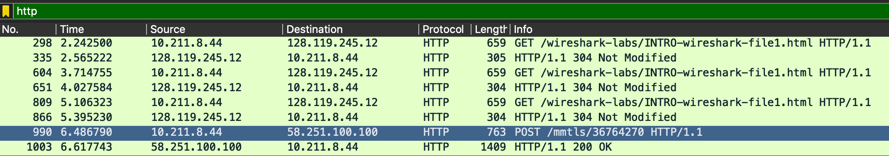
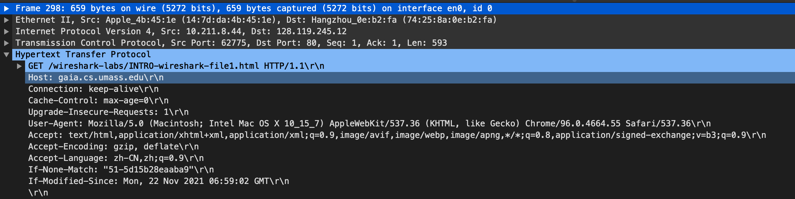
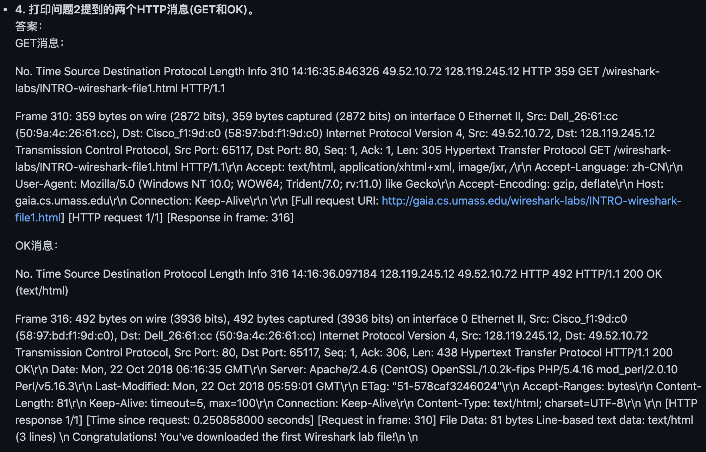

# 第一章 计算机网络和因特网

#### 课后题答案

- R1.
	主机是一种端系统🤔。手机，手表，汽车等都是端系统。Web服务器当然是一种端系统。
	Note：主机就是端系统，主机和端系统没有什么区别。
- R2.
	协议就是约定好一起遵守的规则。
- R3.
	标准定义了协议的要做什么和具体内容。
- R4.
	住宅接入：光纤到户、DSL接入（Digital Subscriber Line，数字用户线路）
	公司接入：WiFi、以太网
	广域无线接入：3G、4G、5G
- R5.
	Hybrid Fiber－Coaxial网即混合光纤同轴网络，是以光纤为骨干网络，同轴电缆为分支网络的高带宽网络。其在用户间是共享的。在下行信道中不会发生碰撞，因为分组是从一个源发出，由不同的端系统接受，因此不存在冲突。
- R6.
	略。光纤到户等。速度从几M~几十M不等。
- R7.
	以太的传输速率是10M~10Gbps不等
- R8.
	能够运行以太网的物理媒介有同轴电缆、双绞铜线、光纤等等。
- R9.
	拨号调制解调器： 速率56kbps 带宽专用（未查到 看其他人答案）  
	HFC： 下行速率：42.8Mbps 上行速率：30.7Mbps 带宽共享  
	DSL： 下行速率：24Mbps 上行速率:2.5Mbps 带宽共享  
	FTTH: 平均下行速率：20Mbps 带宽共享
- R10.
	WiFi和4G接入。 WiFi速度快但距离短，4G速度慢但距离远。
- R11.
	忽略排队时延、传播时延和处理时延，那总时延=L/R1+L/R2。
- R12.
	TDM是时分复用技术，FDM是频分复用技术。
	电路交换网络适合实时服务。交付质量高。
	TDM比FDM的优点如下：（来源于网络）  
	1. 当发生拥塞等网络问题时，TDM中的数据丢失可能只会是一部分，而FDM中就可能是大部分或全部。  （数据包丢失角度）
	2. TDM适合数字信号传输，而FDM适合模拟信号传输，因为现在通信网络多是传输数字信号，所以TDM比FDM好。  （信道传输角度）
	3. 因为频分复用连接建立后，当中途没有数据传输时，他所占有的频段带宽不能被其他连接使用，故可能存在空置，而在时分复用的统计时分模式下，连接建立后，当某个连接暂时不用传输数据时可以少分时间片或者不分，即其时隙的分配时“按需分配”，这样就让出了相应的传输时间给其他连接。（使用效率角度）
- R13.
	a.电路交换时，只能够支持2个用户。因为电路交换是独占式的。
	b.如果两个或更少的用户在传输，即使它们同时传输，也仅仅完全占用了2Mbps链路，不会造成排队。如果有3个用户同时传输，需要3Mbps，而此时链路只有2Mbps，因此将会有排队时延。
	c.指定用户正在传输的概率为20%。那就是1Mbps*20%=200Kbps
	d.所有3个用户在同时传输的概率=0.2*0.2*0.2=0.008，队列增长的时间比率=0.008，因为只有在3个用户时，队列才会增长。
- R14.
	IXP（Internet Exchange Point，互联网交换中心），是不同电信运营商之间为连通各自网络而建立的集中交换平台。
	同级别ISP之间的所有流量可以直接连接而不是通过上游ISP传输。
	IXP可以通过交换的流量对ISP收费。
- R15.
	谷歌的网络：在本书写作的时候，谷歌估计有30-50个数据中心。谷歌的数据中心经过专用的TCP/IP网络互连，该网络跨越全球，但仍然独立于公共因特网。  
	内容提供商构建这些网络的动机是：直接与较低层ISP对接，减少向ISP支付的费用。对其服务最终如何交付给端用户有了更多的控制。
- R16.
	端到端时延组成部分有：节点处理时延、排队时延、传输时延、传播时延。
	其中，节点处理时延——检查分组首部和决定该分组导向何处；排队时延——分组在链路上等待传输的时间；传输时延——路由器逐比特推出（发射）分组所需要的时间，从该分组到达该路由器的第一个比特开始计时，直到该分组的最后一个比特到达。宏观来讲传输时延=分组长度/分支链路的传输速率。传播时延——从当前链路的起点到链路的终点所需要的时间。因此，
	时延中固定的部分有：节点处理时延、传输时延、传播时延
	时延中不固定的部分有：排队时延（与网络流量有关）
- R17.
	略
- R18.
	时间 = 2500km/2.5*10^8m/s + 1000*8bits/2*1024*1024 = 14ms
	一般化时间 = 8*L/R + d/s（注意单位）
- R19.
	a.整条链路的吞吐量直接取最小，min{R1,R2,R3}
	b.4MB/R1+4MB/R2+4MB/R3
	Note：Error！应该是直接除最小吞吐量，因为时间是由瓶颈链路传输速率决定。也就是4MB/min{R1,R2,R3}
	c.与b同理
- R20.
	端系统通过应用层协议将文件分组打包。
	查路由器上不断更新的路由表，即路由器使用分组中的IP地址来决定将该分组转发到哪一条路。
	每个路由器都有一个转发表，当某分组到达一台路由器时，路由器检查IP地址，并用这个地址搜索转发表，以发现适当的输出链路。这种方式与沿途询问方向类似。（其实就是近邻原则）
- R21.
	略
- R22.
比如运输层，TCP的任务有划分为短报文，拥塞控制，流量控制，可靠性等等。它的任务不是由两个（或更多）层次执行的。但是，很多层次的任务是互相重复的。
- R23.
	因特网协议栈的5个层次自顶向下包括：应用层、运输层、网络层、数据链路层和物理层。其中，
	应用层：提供了一些网络应用程序和应用层协议。  
	运输层：在应用程序端点之间传输运输层报文。主要有TCP和UDP两种协议。  
	网络层：负责将分组从一台主机移动到另一台主机。  
	链路层：沿着路经将数据报传递给下一层结点。  
	物理层：将整个帧从一个网络元素移动到邻近的网络元素。
- R24.实际上就是报文分组在协议栈不同层的定义，报文→报文段→数据报→帧
	应用层报文：一个端系统与另一个端系统应用程序交换信息的分组。  
	运输层报文段：运输层的分组  
	网络层数据报：网络层的分组  
	链路层帧：链路层的分组
- R25.
	网络层路由器处理网络层及以下，也就是网络层、链路层和物理层。
	链路层交换机处理链路层及以下，也就是链路层和物理层。
	主机自然处理的是应用层及以下，因为是端系统，是发送源，也是接收端。
- R26.
	病毒：需要用户交互才能感染设备。  
	蠕虫：不需要用户交互就能感染设备。
- R27.DoS攻击包括弱点攻击、带宽洪泛、连接洪泛；DDoS（Distributed Dos，分布式DoS）：单端系统DoS攻击容易被上游路由器检测并拦截，因此靠僵尸网络中的多受控源端系统并发，使攻击流量分散，达到DoS攻击相同的目的。
	恶意软件控制了很多网络设备，并利用控制的网络设备对目标主机展开垃圾邮件分发或分布式拒绝服务供给，统称为僵尸网络。
	利用恶意软件，僵尸网络中的网络设备向目标主机发送大量的分组，或者创建大量连接等等，使目标主机陷入困境。这就是僵尸网络被用于DDoS攻击的效果。
- R28.
	Trudy可以进行嗅探分组，得到传输分组的副本（即在无线传输设备的附件防止一台被动的接收机，该接收机记录每个流经的分组副本），还可以进行IP哄骗，冒充另一个用户（即人工制作假的源地址分组注入，以冒充另一个用户。这用到的是网络没有分析只有转发的功能）。

#### 课文中实验答案

#### 编程作业和答案

#### Wireshark实验和答案

- 1.列出上述步骤7中出现在未过滤的分组列表窗口的协议列中的3种不同的协议。

答：HTTP协议、TCP协议、UDP协议

- 2.从HTTP GET消息发送到HTTP OK回复需要多长时间？ (默认情况下，分组列表窗口中的时间列的值是自Wireshark开始捕获以来的时间(以秒为单位)。要想以日期格式显示时间，请选择Wireshark的“视图”下拉菜单，然后选择“时间显示格式”，然后选择“日期和时间”。)

答：T=2.565222-2.242500=0.322722s

- 3.[gaia.cs.umass.edu](http://gaia.cs.umass.edu)([也称为wwwnet.cs.umass.edu](http://xn--wwwnet-vy7izji575a.cs.umass.edu))的Internet地址是什么？您的计算机的Internet地址是什么？

答：[gaia.cs.umass.edu](http://gaia.cs.umass.edu)的Internet地址是128.119.245.12

我的计算机的Internet地址是10.211.8.44

- 4.打印问题2提到的两个HTTP消息(GET和OK)。要这样做，从Wireshark的“文件”菜单中选择“打印”，然后选择“仅选中分组”和“按当前显示”按钮，然后单击确定。

答：MacOS上在未连接打印机的情况下发起不了print，实际按照问题指示操作即可，这里用别人的答案来展示一下。

作业文档在Web站点[https://gaia.cs.umass.edu/kurose_ross/wireshark.php](https://gaia.cs.umass.edu/kurose_ross/wireshark.php)

