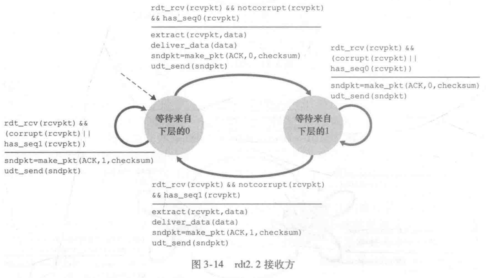
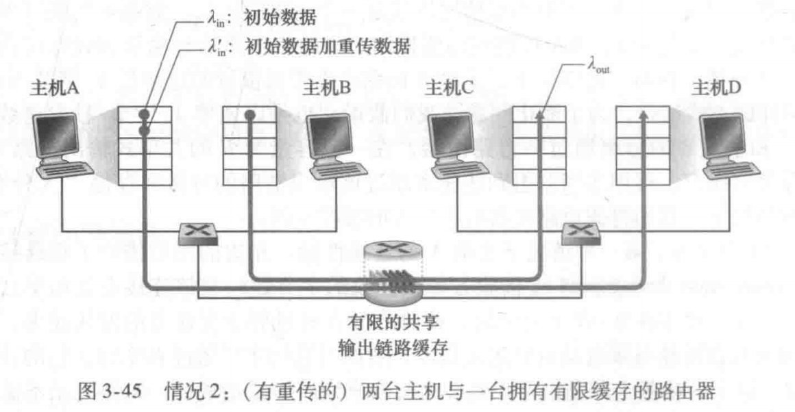
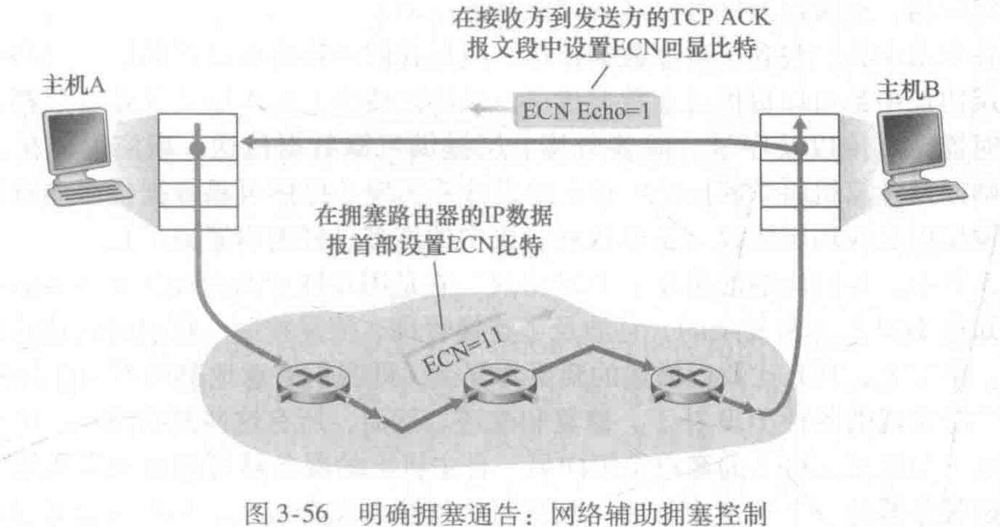

# 第三章 运输层

#### **读书笔记**P139~P205（教材P121~P197）

- 概述和运输层服务
	在端系统而不是路由器中实现，为运行在不同主机上的应用进程提供了**逻辑通信**（logic communication）功能。运输层协议将从发送应用程序进程接收到的报文转换成运输层分组（将报文划分为较小的块，并为每块加上一个运输层首部以生成）——运输层**报文段**（segment）。然后，在发送端系统中，运输层将这些报文段传递给网络层，网络层将其封装成网络层分组——**数据报**并向目的地发送。这里网络路由器仅作用于数据报的网络层字段，它们不检查封装在数据报的运输层报文段的字段。在接收端，网络层从数据报中提取运输层报文段，并将报文段向上交给运输层。运输层则处理接收到的报文段，使该报文段中的数据为接收应用进程使用。
	- 运输层和网络层的关系
		**网络层**提供**主机**间的**逻辑通信**，**运输层**则为运行在主机上的**进程**之间提供**逻辑通信**。运输层只在各自主机上工作，将进程需要发送的报文分别转成报文段，向下交由网络层发送，中间路由器既不处理也不识别运输层加在应用层报文的任何信息。
		运输层依托于下层网络层，网络层同样依托于更下层的链路层和物理层。因此，运输层协议能够提供的服务往往受制于底层网络层协议的服务模型。比如，如果网络层协议不保证时延或带宽，那运输层同样不能保证应用程序的时延或带宽。然而上下层既耦合又松散，即使底层网络协议不能在网络层提供相应的某些服务，运输层协议也能提供某些服务。比如，网络层可能分组丢失、篡改和冗余，但运输层依然能够提供可靠的数据传输服务；网络层不能保证运输层报文段的机密性，运输协议也能使用加密来确保应用程序不被入侵者读取。
	- 因特网运输层概述
		因特网网络层协议——IP协议，即网际协议。IP为主机之间提供了逻辑通信。IP的服务模型是**尽力而为交付服务**（best-effort delivery service），显然它并不做任何确保，因此是**不可靠服务**（unreliable service）。注意！每台主机至少有一个网络层地址，即IP地址。
		UDP和TCP最基本的责任是，将两个**端系统间**IP的交付服务**扩展为**运行在端系统上的两个**进程之间**的交付服务（把各兄弟姐妹的信件收纳到投递代表这里）。将主机间交付扩展到进程间交付被称为运输层的**多路复用**（transport-layer multiplexing）与**多路分解**（demultiplexing）。UDP和TCP还可以通过报文段首部中的字段如差错检查字段来提供完整性检查。
		UDP也是一种不可靠服务，但TCP提供诸如**可靠数据传输**（reliable data transfer）、**拥塞控制**（congestion control）等服务
- 多路复用与多路分解
	- 将运输层报文段中的数据交付到正确的套接字的工作称为多路分解。
	- 在源主机从不同套接字中收集数据块，并为每个数据块封装上首部信息从而生成报文段，然后将报文段传递到网络层，所有这些工作称为多路复用。
		运输层多路复用要求：①套接字有唯一标识；②每个报文段有特殊字段来指示该报文段所要交付到的套接字。运输层报文段主要构成如下：
		
		**源端口号**（source port number field），**目的端口号**（destination port number field），端口号是16比特，即0~65535，其中0~1023范围的端口号称为**周知端口号**（well-known port number），**其他首部字段**以及**应用数据（报文）**，当我们开发一个新的应用程序时，必须为其分配一个端口号。
		多路分解过程举例：
		
		1. 无连接的多路复用与多路分解
			套接字的两种建立方式：
				```Python
				clientSocket = socket(AF_INET, SOCK_DGRAM) #1
				clientSocket.bind(('', port)) #2
				```
				
			通常应用程序的客户端让运输层自动地（并且是透明地）分配端口号，而服务器端则分配一个特定的端口号。
			UDP交互的一次详细过程如下：
			
			报文段中包含源端口号，因为源端口号可以用作“返回地址”的一部分。即当B需要回发一个报文段给A时，B到A的报文段中的目的端口号便从A到B的报文段中的源端口号中取值（完整的返回地址是A的IP地址和源端口号）。
		2. 面向连接的多路复用与多路分解
			TCP套接字是由一个四元组（源IP地址，源端口号，目的IP地址，目的端口号）来标识的。因此，与UDP不同的是，两个具有不同源IP地址或源端口号的到达TCP报文段将被定向到两个不同的套接字，除非TCP报文段携带了初始创建连接的请求。
		3. Web服务器与TCP
			连接套接字与进程之间并非总是有着一一对应的关系。当今的高性能Web服务器通常只使用一个进程，但是为每个新的用户连接创建一个具有新连接套接字的**新线程**。（线程被看作是一个轻量级的子进程）。对于这样一台服务器，在任意给定的时间内都可能有（具有不同标识的）许多连接套接字连接到相同的进程。
			注意！原因是TCP连接除了目的端IP地址、目的端口号外，还跟源IP地址以及源端口号相关。
- 无连接运输：UDP
	运输层最低限度必须提供一种复用/分解服务，以便在网络层与正确的应用级进程之间传递数据。
	UDP举例——DNS服务器工作原理：
	
	什么情况下更适用UDP？
1. 关于“发送什么数据”以及“何时发送”的应用层控制更为精细。TCP存在拥塞控制机制和延迟交付等限制。UDP适用**需求最小的发送速率、不希望过分地延迟报文段的传送**、且**能容忍一些数据丢失**的情况。
2. 无须连接建立。TCP在开始数据传输之前的三次握手会引入建立连接的时延，很多情况下接受不了。而且用UDP作为运输协议可以通过在UDP之上的应用层协议中实现可靠性，比如谷歌的chrome浏览器中的QUIC协议就是这么干的。
3. 无连接状态。TCP需要在端系统中维护连接状态，包括接收和发送缓存、拥塞控制参数以及序号与确认号的参数。UDP不维护连接状态也不需要跟踪这些参数。因此，某些专门用于某种特定应用的服务器当应用程序运行在UDP之上而不是运行在TCP上时，一般都能支持更多的活跃客户。
4. 分组首部开销小。TCP报文首部20字节，UDP首部8字节（但我认为这不是重点）。
UDP的争议：

UDP缺乏拥塞控制能够导致UDP发送方和接收方之间的高丢包率，并挤垮TCP会话。目前已提出新的机制，以促使所有的数据源（包括UDP源）执行自适应的拥塞控制。通过在应用程序自身建立可靠性机制来完成（例如增加确认与重传机制）

- UDP报文结构


UDP报文结构如上图3-7所示，其中长度字段指示了在UDP报文段中的字节数（首部加数据）。因为数据字段的长度在一个UDP段中不同于在另一个段中，故需要一个明确的长度。

检验和来检查在该报文段中是否出现了差错。

- UDP检验和

发送方的UDP对报文段中的所有16比特字的和进行反码运算，求和时遇到的任何溢出都被回卷（即加到末尾）。得到的结果被放在UDP报文段中的检验和字段。在接收方，全部的16比特字（包括检验和）加在一起，如果该分组中没有引入差错，则在接收方处该和将是16个1。如果这些比特之一是0，那么我们就知道该分组中已经出现了差错。举例如下：


为什么UDP首先提出检验和？

在既无法确保逐链路的可靠性，又无法确保内存中的差错检测的情况下，如果端到端数据传输服务要提供差错检测，UDP就必须在*端到端基础上*在运输层提供差错检测。这是一个在系统设计中被称颂的**端到端原则**（end-end principle）的例子，该原则表述为因为某种功能（在此时为差错检测）必须基于端到端实现：“与在较高级别提供这些功能的代价相比，在较低级别上设置的功能可能是冗余的或几乎没有价值的。”

注意！虽然UDP提供差错检测，但它对差错恢复无能为力。现有方法一种是丢弃受损的报文段；一种是将受损的报文段交给应用程序并给出警告。

- 可靠数据传输原理
	
	**可靠数据传输协议**（reliable data transfer protocol）为上层实体提供的服务抽象是“数据可以通过一条可靠的信道进行传输”。借助于可靠信道，传输数据比特就不会受到损坏（由0变为1，或者相反）或丢失，而且所有数据都是按照其发送顺序进行交付。但可靠数据传输协议的下层协议也许是不可靠的，比如TCP是在不可靠的（IP）端到端网络层之上实现的可靠数据传输协议。更一般的情况是，两个可靠通信端点的下层可能是由一条物理链路（如在链路级数据传输协议的场合下）组成或是由一个全球互联网络（如在运输级协议的场合下）组成。即直接将较低层直接视为不可靠的点对点信道。
	- 构造可靠数据传输协议
		1. 经完全可靠信道的可靠数据传输：rdt1.0
			
			发送方和接收方都有**有限状态机**（Finite-State Machine，FSM），其中实线箭头指示了协议从一个状态变迁到另一个状态。引起变迁的事件显示在表示变迁的横线上方，事件发生时所采取的动作显示在横线下方。如果一个事件没有动作，就在横线上方或下方使用符号A，以分别明确地表示缺少动作或事件。FSM的初始状态用虚线表示。
			
		2. 经具有比特差错信道的可靠数据传输：rdt2.0
			通过使用**肯定确认**（positive acknowledgement）（“OK”）与**否定确认**（negative acknowledgement）（“请重复一遍”）。基于这种重传机制的可靠数据传输协议成为**自动重传请求**（Automatic Repeat reQuest，ARQ）**协议**。
			- 差错检测技术和纠错技术——接收方可以检测并可能纠正分组中的比特差错。这些技术要求额外的比特（除了待发送的初始数据比特之外的比特），将被汇聚在rdt2.0数据分组的分组检验和字段中。
			- 接收方反馈——“肯定确认”（ACK）/“否定确认（NAK）”
			- 重传——发送方重传
			rdt2.0——
			
			a)**停等**（stop-and-wait）：发送方将不会发送一块新数据，除非发送方确信接收方已正确接收当前分组。
			rdt2.1——用分组序号0/1、肯定确认ACK/否定确认NAK来解决ACK/NAK分组可能受损的问题
			
			
			rdt2.2——用分组序号0/1、只用肯定确认ACK来解决ACK/NAK分组可能受损的问题
			
			
		3. 经具有比特差错的丢包信道的可靠数据传输：rdt3.0
			现实计算机网络，除了比特受损外，底层信道还会丢包。为解决“怎样检测丢包以及发生丢包后该做些什么”的问题。该做什么在上面rdt2.2中已经解决，就是使用检验和、序号（因为分组序号在0和1之间交替，因此rdt3.0有时被称为**比特交替协议**（alternating-bit protocol））、ACK分组和重传等规则即可。
			于是rdt3.0为解决丢包问题增加一种新的协议机制——**倒计时定时器**（countdown timer）**机制**。发送方等待一个明智的时间，超过时间未收到确认返回，就重传（显然，这可能会引入**冗余数据分组**（duplicate data packet），但rdt2.2就已经可以解决冗余问题。
			发送方需要做到：①每次发送一个分组（包括第一次分组和重传分组）时，启动一个定时器；②响应定时器中断；③终止定时器。
			
			注意！跟rdt2.2不同的是，当发送方接收到前一个分组的确认肯定ACK时，不是直接重传，而是continue之后等timeout后再重传。**（这样不会更慢吗？为什么不直接重传，同时reset_timer呢？）**
			答：为了避免由于网络超长时延导致的超时重传后连续接收到两次收到前次分组的确认肯定ACK，再发送产生新的荣誉数据分组。关注图3-16的情况d）过早超时。
			
			小结！构建可靠数据传输协议的要点——**检验和、序号、定时器、肯定和否定确认分组**。至此，我们得到了一个可靠数据传输协议！
		- 流水线可靠数据传输协议
			停等协议，不难想象发送方（或信道）的利用率（Usender utilization）——发送方将发送比特送进信道的时间/发送时间，是非常小的，而同时物理链路中大部分时间都是空闲的。于是提出**流水线**（pipelining）模式，分组不以停等方式运行。
			
			从停等到流水线可靠数据传输协议，引起的变化有：①增加分组序号范围；②协议发送方和接收方两端能够缓存多个分组；③解决流水线的差错恢复——**回退N步**（Go-Back-N，GBN）和**选择重传**（Selective Repeat，SR）
		- 回退N步
			
			N被称为窗口长度（window size），GBN协议也常备称为滑动窗口协议（siding-window protocol）
			回退N步的FSM状态描述：
			
			图3-21中的细节解读：
			
			对于接收方来讲，因为数据要向上层按序交付，因此如果分组n丢失，则该分组及分组n+1最终将在发送方根据GBN重传规则而被重传。因此，接收方只需丢弃分组n+1即可。虽然这样重传的n+1分组或许会丢失或出错而甚至需要更多的重传。
			GBN举例：
			
			图3-22过程解读：
			
			注意！在协议栈中实现该协议可能是以各种过程形式出现，每个过程实现了在响应各种可能出现的事件时要采取的行动。这被称为基于事件的编程（event-based programming）。这些过程要么被协议栈中的其它过程调用，要么作为一次中断的结果。如在发送方，这些事件包括：①来自上层实体的调用去调用rdt_send()；②定时器中断；③报文到达时，来自下层的调用去调用rdt_rcv()。
		- 选择重传（SR）
			单个分组的差错就能够引起GBN重传大量分组，许多分组根本没有必要重传。随着信道差错率的增加，流水线可能会被一这些不必要重传的分组所充斥。因此要让发送方仅重传那些在接收方出错（丢失或受损）的分组而避免不必要的重传。于是SR发送方与SR接收方的事件与动作如下：
			
			SR操作过程举例：
			
			那么怎么防止ACK消息在传输过程中丢失呢？
			
			因此，窗口长度的设置变得关键。如下图3-27揭示了一个问题——接收方可能无法区分收到的分组是重传分组还是初次传输的分组。
			
			结论：对于SR协议而言，窗口长度必须小于或等于序号空间大小的一半。作业题中有实验。
			
			还有最后一个问题，以上所述的可靠数据传输协议都基于一个假定——分组在发送方与接收方之间的信道中不能被重新排序。显然这种假设只能在发送方与接收方由单段物理线路相连的请款修改成立。而实际连接两端的“信道”是一个网络，分组重新排序是可能会发生的。也就是说，可能出现一个具有序号或确认号x的分组的旧副本可能会出现，即使发送方或接收方的窗口中都没有包含x。
			那解决办法是什么？实际上是信道可被看成基本上是在缓存分组，并在将来的任意时刻自然地释放出这些分组。这对于序号可以被重新使用是一个重大漏洞。于是在实际应用中采用的方法是，确保一个序号不被重新使用，知道发送方“确信”任何先前发送的序号为x的分组都不再在网络中为止。通过假定一个分组在网络中的“存活”时间不会超过某个固定最大时间量来做到，[RFC 1323]中给的最大分组寿命大约为3分钟。而在[Sunshine 1978]中描述了一种使用序号的方法，能够完全避免重新排序问题。
- 面向连接的运输：TCP
	- TCP连接（connection-oriented）
		TCP“连接”不是一条像在电路交换网络中的端到端TDM或FDM电路，它只是一条逻辑连接，其共同状态仅保留在两个通信端系统的TCP程序中。因此在网络中间元素（如路由器和链路层交换机）中都是没有的，他们不会维持TCP连接状态。事实上，中间路由器对TCP连接完全视而不见，它们看到的是数据报，而不是连接。
		同时，TCP是点对点（point-to-point）的，即在单个发送方与单个接收方之间的连接。因此，“多播”对TCP来说是不可能的。
		**建立连接（三次握手）的过程：**客户首先发送一个特殊的TCP报文段，服务器用另一个特殊的TCP报文段来响应，最后，客户再用第三个特殊报文段作为响应。前两个报文段不承载“有效载荷”，也就是不包含应用层数据；而第三个报文段可以承载有效载荷。由于在这两台主机之间发送了3个报文段，所以这种连接建立过程常被称为**三次握手**（three-way handshake）。
		**TCP的数据发送和接收：**客户进程通过套接字传递数据流。数据通过该套接字，就由客户中运行的TCP控制。TCP将这些数据引导到该连接的**发送缓存**（send-buffer）中，发送缓存是发起三次握手期间设置的缓存之一。然后TCP根据**最大报文段长度**（Maximum Segment Size，MSS）从缓存中取出并放入报文段。MSS的大小则是根据发送主机的**最大链路层帧长度即最大传输单元**（Maximum Transmission Unit，MTU）来设置。MSS通常包括一个TCP报文段（通常1460字节）和一份TCP/IP首部字段（通常40字节）。**注意！这里的MSS指在报文段中应用层数据的最大长度，而不是指包括首部的TCP报文段的最大长度。**然后这些TCP报文段向下传递给网络层，网络层将其分别封装在网络层IP数据报中，然后发送到网络中。当目的端TCP接收到一个报文段后，该报文段的数据就被放入该TCP连接的接收缓存中。再由应用程序从此缓存中读取数据流。整个交换过程如下图3-28所示：
		
		以上可见，TCP连接的组成包括：**一台主机上的缓存**、**变量**和**与进程连接的套接字**，以及**另一台主机上的另一套**这三样。
	- TCP报文段结构
		TCP/IP首部字段（40字节）其中TCP首部一般是20字节，因为后20字节选项字段通常为空。当TCP发送一个大文件时，每个报文段的数据块长度都为MSS（最后一块除外，它通常小于MSS），而交互式应用的数据块长度通常小于MSS。比如Telnet发送的报文段也许只有21字节长。
		
		**源端口号/目的端口号**：用于多路复用/分解来自或送到上层应用的数据；
		**检验和字段**（checksum field）：用于报文段数据校验；
		**32比特序号字段**（sequence segement field）/32比特确认号字段（acknowledgment number field）：用于被TCP发送方和接收方用来实现可靠数据传输服务；
		**16比特接收窗口字段**（receive window field）：用于流量控制，指示接收方愿意接受的字节数量；
		**4比特首部长度字段**（header length field）：用于指示32比特的字为单位的TCP首部长度。结合上文不难推测首部长度字段介于0~10（包含10）之间；
		**可选与变长的选项字段**（options field）：用于发送方与接收方协商最大报文段长度（MSS）时，或在高速网络环境下用作窗口调节因子时；
		**6比特的标志字段**（flag field）：**ACK比特**用于指示确认字段中的值是有效的，即该报文段包括一个对已成功接收报文段的确认；**RST、SYN、FIN比特**用于连接建立和拆除；**CWR、ECE比特**用于拥塞控制；**PSH比特**用于控制接收方是否立即将数据交给上层；**URG比特**用于指示报文段里存在着被发送端的上层实体置为“紧急”的数据。紧急数据的最后一个字节由16比特的**紧急数据指针字段**（urgent data pointer field）指出。***在实践中，PSH、URG和紧急数据指针并没有使用。**
		1. **序号和确认号**
			序号是建立在传送的字节流纸上，而不是建立在传送的报文段的序列之上。
			一个报文段的**序号**（sequence number for a segment）因此是该报文段首字节的字节流编号。假设有一个案例如下，MSS=1000字节，主机A向主机B发送的一个数据流包含500000字节，数据流的首字节编号是0，则该TCP将为该数据流构建500个报文段。示意图如下：
			
			确认号（acknowledge number）：主机B上到达的每个报文段中都有一个序号用于指示从B流向A的期望数据。也就是说主机A填充进报文段的确认号是主机A期望从主机B收到的下一个字节的序号。比如，主机A已收到主机B的编号为0~535的所有字节，同时它打算发送一个报文段给主机B，这时主机A就会在它发往主机B的报文段的确认号字段中填上536；再比如，当主机A已收到主机B的编号为0~535以及900~1000的报文段，主机A为了重新构建主机B的数据流，扔在等待字节536（和其后的字节），因此，A到B的下一个报文段将在确认号字段中包含536，即TCP提供累计确认（cumulative acknowledgment）。
		2. **Telnet：序号和确认号的一个学习案例**
			现在都在用SSH协议做远程登录，不用Telnet的原因是Telnet连接中发送的数据（包括口令！）是没有加密的，这使得Telnet易于受到窃听攻击。
			
			图3-31显示了一个特征，就是用户键入的每个字符都会被发送至远程主机；远程主机将会送每个字符的副本给客户。用户键入“C”，主机A提供起始序号42，和主机B期望序号79（由于是第一次发送，实际上79就是服务器的起始序号）；主机B收到并确认“C”后，通过ACK=43告诉客户它已经成功收到字节42及以前的所有字节，通过data='C'给客户回显收到的字符，主机B发送的消息同时也是确认消息（**捎带**（piggybacked））；主机A收到主机B的回显后消息后，再次发送确认消息，此示例是空消息，但仍有序号，确认号字段为80，告诉主机B它已经成功收到字节79及以前的所有字节，接下来等待字节80的出现，而发送当前报文段的序号Seq为43。
		- 往返时间的估计与超时
			1. 估计往返时间
				EstimatedRTT = (1 - alpha) · EstimatedRTT + alpha · SampleRTT（其中，alpha在[RFC 6298]中的推荐值是0.125）
				以上计算公式是一种平均，被称为**指数加权移动平均**（Exponential Weighted Moving Average，EWMA），这种平均能使得SampleRTT的变化在EstimatedRTT的计算中趋于平缓。
				
				除了估算RTT外，测量RTT的变化也是有价值的，那么如何测量RTT偏差呢？
				DevRTT = (1 - beta) · DevRTT + beta · |SampleRTT - EstimatedRTT|
				显然，DevRTT是一个SampleRTT与EstimatedRTT之间差值的EWMA。其中，beta的推荐值为0.25。
			2. 设置和管理重传超时间隔
				超时间隔肯定大于等于EstimatedRTT，但不能大太多。经验规则如下：
				TimeoutInterval = EstimatedRTT + 4 · DevRTT
				推荐的TimeoutInterval值为1s。同时，当出现超时时，TimeoutInterval要翻倍，以免即将被确认的后继报文段过早出现超时。然而，只要收到报文段并更新EstimatedRTT，就使用上述公式再次计算TimeoutInterval。
			- 可靠数据传输
				TCP只用超时来恢复报文段的丢失，同时除了使用超时机制外，还使用冗余确认技术。以下案例假定从主机A向主机B发送一个大文件。
				
				详细探讨：
				1. 一些有趣的情况
					TCP设计的微妙之处，很好地解决了各种未收到确认并重传的情况。比如，由于确认丢失而重传的情况、连续多个报文中某个报文重传后后续报文避免重传的情况、以及累计确认避免了第一个报文段的重传的情况。
				2. 超时间隔加倍
					每当超时事件发生时，TCP重传具有最小序号的还未被确认的报文段，并且每次TCP重传时都会将下一次的超时间隔设为先前值的两倍，而不是用从EstimatedRTT和DevRTT推算出的值。然后，每当定时器在另两个事件（即收到上层应用的数据和收到ACK）中的任意一个启动时，TimeoutInterval由最近的EstimatedRTT值与DevRTT值推算得到
				3. 快速重传
					因为TCP不使用否定确认，所以接收方不能向发送方发回一个显式的否定确认。但是，超时触发重传又存在一个问题是超时周期可能相对较长。当一个报文段丢失时，这种长超时周期迫使发送方延迟重传丢失的分组，因而增加了端到端时延。因此用快速重传机制来解决这一问题，快速重传的关键就是**冗余ACK**（duplicate ACK），就是再次确认某个报文段的ACK，而发送方先前已经收到对该报文段的确认。为什么这么做，因为当TCP接收方收到一个具有序号大于下一个所期望的、按序的报文段，即接收方数据流中存在一个间隔的时候，这就是说有报文段丢失或重新排序，因此发一个冗余ACK提醒发送方。
					
					对于发送方来说，因为发送方经常一个接一个地发送大量的报文段，如果一个报文段丢失，就很可能引起许多一个接一个的冗余ACK。因此如果TCP发送方接收到对相同数据的3个冗余ACK，就被发送方理解为在这个已被确认过3次的报文段之后的报文段已经丢失。于是发送方TCP就执行**快速重传**（fast retransmit），也就是在该报文段的定时器过期之前重传丢失的报文段。
					于是，对图3-33中的事件三可以这样优化：
					
				4. 是回退N步还是选择重传
					TCP的差错恢复机制是GBN协议与SR协议的混合体。对TCP提出的一种修改意见**选择确认**（selective acknowledgment）它允许TCP接收方有选择地确认失序报文段，而不是累计地确认最后一个正确接收的有序报文段。（在TCP中，TCP发送方与GBN中的发送方一样，只维护未被确认的字节的最小序号（SendBase）和下一个要发送的字节的序号（NextSeqNum）。同时在TCP接收方，对收到的失序报文段和SR协议中一样，先缓存暂时不向上层应用层交付，但不同的，接收方会有选择地确认失序报文段，而发送方一直未收到某个报文段的ACK消息，就只重传这一个报文段，而不是像GBN协议一样后续每一个都重传）
				- 流量控制
					因为TCP接收方收到数据后会先将数据放入接收缓存，相关联的应用进程会在需要的时候从该缓存中读取数据，而不是数据刚到就立即读取。因此，如果某应用程序读取数据时相对缓慢，而发送方数据发送地太多、太快，发送的数据就会很容易地使连接的接收缓存溢出。因此由TCP为它的应用程序提供**流量控制服务**（flow-control services）以消除发送方使接收方缓存溢出的可能性。同时，TCP发送方也可能因为IP网络的拥塞而被遏制，这种作用于发送方的控制则是**拥塞控制**（congestion control）
					TCP通过让发送方维护一个称为**接收窗口**（receive window）的变量来提供流量控制。接收窗口用于给发送方一个指示——该接收方还有多少可用的缓存空间。因为TCP是全双工通信，在连接两端的发送方都各自维护一个接收窗口。对于主机B而言，需满足
					LastByteRcvd - LastByteRead ≤ RcvBuffer
					用接收窗口rwnd表示，根据缓存可用空间的数量来设置：
					rwnd = RcvBuffer - [LastByteRcvd - LastByteRead]
					那么对于发送方而言，则只要满足以下条件就可以保证主机B的接收缓存不会溢出。
					LastByteSent - LastByteAcked ≤ rwnd
					注意！其实这里有一个问题，假设主机B的接受缓存存满使得rwnd=0，再假设rwnd=0的消息发送给主机A后，主机B没有任何数据要发给主机A了。这样的话岂不是无论发生什么，主机A都永远认为rwnd = 0。即主机A被拥塞而不能再发送数据。为了解决这个问题，TCP规范中要求：当主机B的接受窗口为0时，主机A继续发送只有一个字节数据的报文段。这些报文段将会被接收方确认。最终缓存将开始清空，并且确认报文里将包含一个非0的rwnd值。（我的理解就是，当发现返回的rwnd值为0了，就继续发一个试探报文，这个报文只有一个字节）
				- TCP连接管理
					如何建立一条TCP连接，假设运行在一台主机（客户）上的一个进程想与另一台主机（服务器）上的一个进程建立一条连接。客户应用进程首先通知客户TCP，它想建立一个与服务器上某个进程之间的连接（**三次握手**）。
					第一步：客户端的TCP首先向服务器端的TCP发送一个特殊的TCP报文段。客户向服务器发送一个特殊报文段——SYN报文段。同时客户随机选择一个初始序号（client_isn）并放置在TCP SYN报文段的序号字段中。然后封装在IP数据报中发给服务器。
					第二步：服务器主机收到包含TCP SYN报文段的IP数据包，就为该TCP连接分配TCP缓存和变量，并向该客户TCP发送允许连接的报文段。实际操作是在报文段的首部包含3个重要信息。SYN置1，确认号字段置client_isn+1，服务器选择初始序号server_isn。该允许连接的报文段被称为**SYNACK报文段**（SYNACK segment）
					第三步：客户收到SYNACK报文段后，给连接分配缓存和变量。客户将报文段首部确认字段置为server_isn+1，因为连接已经建立，因此SYN置为0，然后再将通信数据捎带在确认报文段的负载中。
					
					假设主机（客户）上的已连接进程想要与另一台主机（服务器）断开连接（**四次挥手**）
					第一步：客户应用进程发出一个关闭连接命令，引起客户TCP向服务器进程发送一个特殊的TCP报文段，该报文段中的FIN比特置为1。
					第二步：服务器收到该报文段后，就向发送方回返一个确认报文段。
					第三步：服务器紧接着发送它自己的终止报文段，其中FIN比特置为1。（服务器发送完就释放所有资源）
					第四步：客户对服务器的终止报文段进行确认。（客户发出确认ACK后等待一个周期后释放所有资源）
					
- 拥塞控制原理
	在实践中，丢包一般是当网络变得拥塞时由于路由器缓存溢出引起的，而分组重传就是网络拥塞的征兆。
	- 拥塞控制原因与代价（以3个复杂性越来越高的发生拥塞的情况）
		1. 情况1：两个发送方和一台具有无穷大缓存的路由器
			
			
			由图中可以看到，在这种（极端）理想化的情况中，拥塞网络有一种代价，即当分组的到达速率接近链路容量时，分组经历巨大的排队时延。
		2. 情况2：两个发送方和一台具有有限缓存的路由器
			
			因为运输层向网络中发送的报文段中含有初始数据或重传数据，因此速率不能直接用发送速率这个术语，此时的速率被称为网络的供给载荷（offered load）。
			
			由图中可以看到，网络拥塞的代价还有“发送方必须执行重传以补偿因为缓存溢出而丢弃（丢失）的分组”，同时“发送方在遇到大时延时所进行的不必要重传会引起路由器利用其链路带宽来转发不必要的分组副本”。
		3. 情况3：4个发送方和具有有限缓存的多台路由器及多条路径
			
			
			由图中可见，对于较小的发送速率，发送速率的增大会导致到达速率的增大。但当发送速率很大的时候，通过上游路由器转发来的速率就接近于0（这里书中用A-C和B-D竞争通过R2的案例），A-C的发送速率被上游路由器R1限制，那么B-D就占尽优势，因此在R2中A-C的到达速率大大降低，因为和B-D竞争有限缓存竞争不过。这里就说明了网络拥塞的又一个代价，就是“当一个分组沿一条路径被丢弃时，每个上游路由器用于转发该分组到丢弃该分组而使用的传输容量最终被浪费掉了。”
		- 拥塞控制方法
			- 端到端拥塞控制
				因为端到端拥塞控制方法中，网络层没有为运输层拥塞控制提供显式支持。端系统只能通过对网络行为的观察（如分组丢失与时延）来推断。比如根据TCP报文段的丢失现象（通过超时或3次冗余确认而得知），TCP会相应地减小其窗口长度。还有比如使用增加的往返时延值作为网络拥塞程度增加的指示。
			- 网络辅助的拥塞控制
				路由器向发送方提供关于网络中拥塞状态的显式反馈信息，这种反馈简单地用一个比特来指示链路中的拥塞情况。更复杂的如**ATM可用比特率（Available Bite Rate，ABR）**拥塞控制中，路由器显式地通知发送方路由器能在输出链路上支持的最大主机发送速率。最近IP和TCP也能够选择性地实现网络辅助拥塞控制。
				通常采用的两种方式，一种是采用一种**阻塞分组（choke packet）**的形式，另一种则是**路由器标记或更新**从发送方流向接收方的分组中的某个字段来指示拥塞的产生。后者至少要经过一个完整的往返时延。
- TCP拥塞控制（TCP策略详解，教材3.7）
	因为TCP是必须使用端到端拥塞控制，于是采用让每一个发送方根据所感知到的网络拥塞程度来限制其能向连接发送流量的速率。三个问题：第一，如何限制发送流量的速率？第二，如何感知网络拥塞？第三，什么算法来控制其改变发送速率？
	解决：
	第一，关于限制发送流量。在发送方TCP拥塞控制机制中维护一个额外的变量，即**拥塞窗口（congestion window）**。拥塞窗口cwnd对一个TCP发送方能向网络中发送流量的速率进行了限制。即LastByteSent - LastByteAcked ≤ {cwnd，rwnd}。为了关注拥塞控制（与流量控制形成对比），假设TCP接收缓存足够大，因此rwnd无限大，因此发送方中未被确认的数据量直接受限于cwnd。同时，我们还假设在拥塞窗口中的所有报文段都要被发送，这个约束直接将未被确认的数据量与发送方的发送速率相关联。即在理想条件（不考虑丢包和发送时延等）下，发送速率就等于cwnd/RTT字节/秒。
	第二，如何感知拥塞。当收到丢包事件（要么超时或收到3个冗余ACK）时认为出现了拥塞。TCP使用确认来触发（或计时）增大它的拥塞窗口长度，TCP被说成是**自计时（self-clocking）**的。
	关于如何设置发送速率的问题，用三个指导性原则回答，
	1. 一个丢失的报文段表意味着拥塞，因此当丢失报文段时应当降低TCP发送方的速率。
	2. 一个确认报文段指示该网络正在向接收方交付发送方的报文段，因此，当对先前未确认报文段的确认到达时，能够增加发送方的速率。
	3. 带宽探测。TCP调节其传输速率的策略是增加其速率以响应到达的ACK，除非出现丢包事件，此时才减小传输速率。
	第三，**TCP拥塞控制算法（TCP congestion control algorithm）**
	1. 慢启动
		在慢启动状态，cwnd的值以1个MSS开始并且每当传输的报文段首次被确认就增加1个MSS，显然cwnd的值将以倍数增长。然后有三种改变慢启动状态的方式。
		第一种，如果存在一个由超时指示的丢包事件（即拥塞），TCP发送方将cwnd置为1并重新启动慢启动过程，同时将“慢启动阈值”ssthresh设置为cwnd/2，即将检测到拥塞时将ssthresh置为拥塞窗口值的一半。
		第二种，因为ssthresh已经设为cwnd的一半，当到达或超过ssthresh的值时，结束慢启动并且TCP转移到拥塞避免模式，在拥塞避免模式中，TCP更为谨慎地增加cwnd。
		第三种，如果检测到3个冗余ACK，这时TCP执行一种快速重传并进入快速恢复状态。
		慢启动中的TCP行为如下图3-51——TCP拥塞控制的FSM描述所示：
		
	2. 拥塞避免
		和慢启动的指数变化相比，TCP算法策略变为每个RTT只将cwnd的值增加一个MSS。例如，MSS是1460字节并且cwnd是14600字节，则在一个RTT内发送10个报文段。每个到达ACK增加(1/10)MSS的拥塞窗口长度，因此在收到所有10个报文段的确认后，拥塞窗口的值将增加一个MSS。
		拥塞避免状态转移同样有两种方式。
		第一种，当出现超时时，与慢启动的情况一样，TCP发送方将ssthresh的值更新为cwnd值的一半，cwnd置为1并重新启动慢启动过程。
		第二种，当累计收到3个冗余的ACK时，将ssthresh的值置为cwnd值的一半，并进入快速恢复状态。
	3. 快速恢复
		快速恢复有两个版本，较老的版本TCP Tahoe中，不管是发生超时指导的丢包事件，还是发生3个冗余ACK指示的丢包事件，都无条件地将其拥塞窗口减至1个MSS，并进入慢启动状态。
		较新版本的TCP Reno中，则综合了快速恢复策略。两者对比举例如下图3-52所示：
		
		三个阶段，传输回合0~4慢启动；回合4~8拥塞避免，在回合8收到3个冗余ACK；回合8之后TCP Tahoe的cwnd直接变为1MSS，然后开始慢启动策略，而TCP Reno则是快速恢复，cwnd直接减少一点变为9MSS（(cwnd/2)+3），然后继续拥塞避免。回合8之后有一点相同的是，两者的ssthresh都变为回合8时cwnd的一半。
	- TCP拥塞控制：回顾
		根据上述三个阶段的算法策略，TCP拥塞控制又被称为**“加性增、乘性减”（Additive-Increase，Multiplicative-Decrease，AIMD）**拥塞控制方式。
	- 对TCP吞吐量的宏观描述
		忽略在超时事件后的慢启动阶段（因为这个阶段非常短），在一个特定的往返间隔内，TCP发送数据的速率是拥塞窗口与当前RTT的函数。当一个丢包事件发生时，我们用W表示窗口长度，假设在连续持续期间RTT和W几乎不变，那么TCP的传输速率在W/(2×RTT)到W/RTT之间变化。在TCP稳态行为中，当速率增长至W/RTT时，网络丢弃来自连接的分组，然后发送速率减半，进而每过一个RTT就发送速率增加MSS/RTT，直到再次达到W/RTT为止。如此循环往复。因此我们有，一条TCP连接的平均吞吐量计算公式如下，
		
		由TCP稳态动态性模型，可以推出一个将连接的丢包率与可用带宽联系起来的表达式。在课后习题中给出。
	- 经高带宽路径的TCP
		网格和云计算应用继续演化以需求更高速高带宽的TCP连接。在本章的课后习题中要求作者推导出一条TCP连接的吞吐量共识，作为丢包率（L）、往返时间（RTT）和最大报文段长度（MSS）的函数：
		
		因为MSS和RTT一般已定，因此对平均吞吐量的需求就是对丢包率L的需求，当平均吞吐量需求很高时，L就需要非常低，比如2×10^(-10)，以至于无法达到，因此需要研究设计新的TCP。
	- 公平性
		完全理想的情况下，是绝对公平的，至少理论上分析是公平的。但实践中，理想条件无法满足，经验告诉我们，当多条连接共享一个共同的瓶颈链路时，那些具有较小RTT的连接能够在链路空闲时更快地抢到可用带宽（即较快地打开其拥塞窗口），因而将比那些具有较大RTT的连接享用更高的吞吐量。
		1. 公平性和UDP
			TCP拥塞窗口机制会控制调节一个应用程序的传输速率。而许多诸如媒体类的应用则不希望如此，即便网络非常拥塞的情况下，因此它们运行在UDP上。UDP源有压制TCP流量的不平等能力。因此，当前有一个主要研究领域就是开发一种因特网中的拥塞控制机制，用于阻止UDP流量不断压制直至中断因特网吞吐量的情况。
		2. 公平性和并行TCP连接
			Web浏览器通常使用多个并行TCP连接来传送一个Web页中的多个对象。我们没有什么办法阻止基于TCP的应用使用多个并行连接。因此，当网络中有并行TCP连接加入时，这条并行的TCP连接将直接分去超过一半的带宽，而不管另一条TCP连接上有多少个用户在线客户-服务器链路。
		- 明确拥塞通告：网络辅助拥塞控制
			新的网络辅助拥塞控制策略已经支持网络层明确向TCP发送方和接收方发出拥塞信号——**明确拥塞通告（Explicit Congestion Notification，ECN）**
			
			


#### 课后题答案

#### 课文中实验答案

#### 编程作业和答案

#### Wireshark实验和答案


