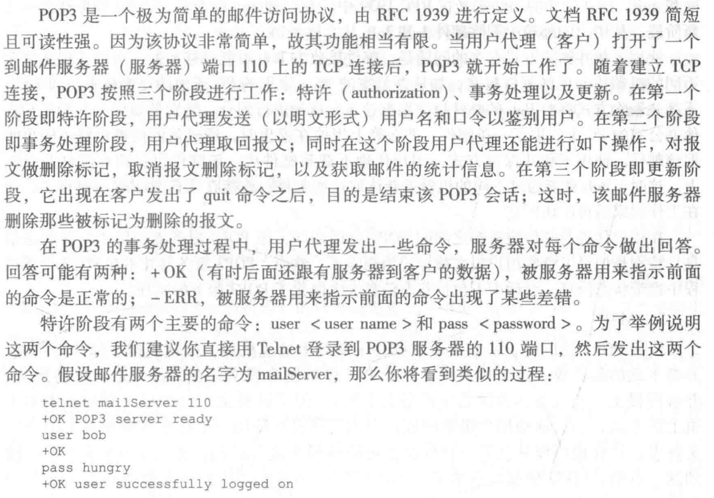
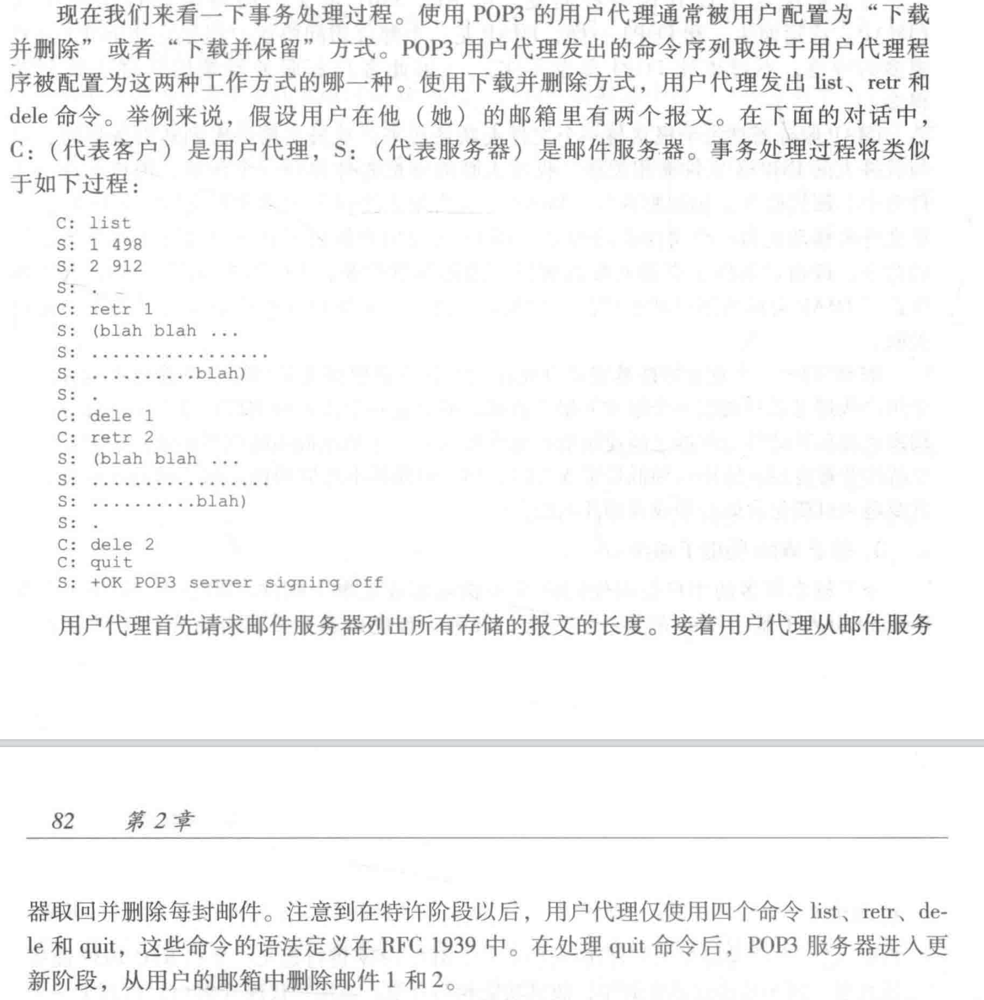
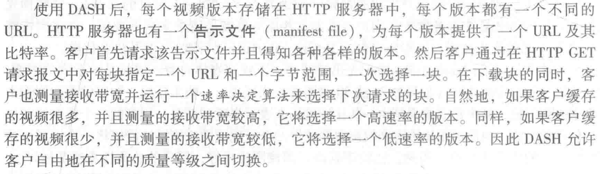

# 第二章 应用层

#### **读书笔记**

- 应用层协议原理
	- 网络应用程序体系结构
		1. 客户-服务器体系结构（client-server architecture）—— 单服务器→数据中心。如今的互联网公司都是这种模式，包括电子邮件mail
		2. P2P体系结构（P2P architecture）——自扩展性。点对点共享型应用的主流方案，如BitTorrent、迅雷、Skype（电话视频会议）
	- 进程通信
		进行通信的实际上是进程（process）而不是程序。在两个不同端系统上的进程，通过跨越计算机网络交换报文（message）而相互通信。报文：发送←>响应
		1. 客户和服务器进程
			
		2. 进程与计算机网络之间的接口
			进程通过套接字（Socket）软件接口向网络发送报文和从网络接收报文。进程好比房间，套接字好比门。套接字是应用层应用程序与传输层之间的接口，是建立网络应用程序的可编程接口，也被称为应用程序和网络之间的应用程序编程接口（Application Programming Interface，API）。
			应用程序开发者可以控制套接字在应用层的一切，但对运输层的控制仅限于：①选择运输层协议；②个别运输层参数，如最大缓存和最大报文段长度等
		3. 进程寻址
			①主机的地址IP address；②在目的主机中指定接收进程的标识符（接收套接字）；③目的地端口号（具体查询在http://www.iana.org）
		- 可供应用程序使用的运输服务——开发应用时根据应用需求选择一种，应用程序服务要求分类如下，
			1. 可靠数据传输（reliable data transfer）—— 运输层协议能够潜在地向应用程序提供一个重要服务是进程到进程的可靠数据传输，其实就是TCP
			2. 吞吐量 —— 发送进程能够向接收进城交付比特的速率。
				确保吞吐量 —— 运输层协议能够以某种特定的速率提供确保的可用吞吐量，比如某应用程序能够请求至少r比特/秒的吞吐量
				带宽敏感的应用（bandwidth-sensitive application）—— 具有吞吐量要求的应用程序（如因特网电话、多媒体应用）
				弹性应用（elastic application）—— 能够根据当时可用的带宽或多或少地利用可供使用的吞吐量（最适合电子邮件、文件传输、Web传送等）
			3. 定时 —— 定时保证，发送方注入套接字中的每个比特到达接收方的套接字不迟于某个时间，如100ms。（最适合交互式实时应用程序，如游戏和会议）
			4. 安全性 —— 加密解密，数据完整性检查、端点鉴别
		- 因特网提供的运输服务
			1. TCP服务
				1. 面向连接的服务。客户-服务器间两个进程建立TCP连接套接字的过程，在应用层数据报文开始流动之前，TCP让客户和服务器互相交换运输层控制信息。
				2. 可靠的数据传输服务。无差错，适当顺序的完整交付
				3. TCP安全。在应用层上实现的对TCP的加强，称为安全套接字层（Secure Sockets Layer，SSL），独立的API。过程描述：明文→客户SSL套接字→客户TCP套接字→服务器TCP套接字→服务器SSL套接字→明文
			2. UDP服务
				1. 不提供不必要服务的轻量级运输协议，仅提供最小服务。
				2. 无连接，没有握手过程。
				3. 不可靠数据传输服务，不保证报文到达，且可能乱序到达。
				4. 发送端可以以选定的任何速率向下层（网络层）注入数据。
			3. 因特网运输协议所不提供的服务
				1. 不提供吞吐量、定时服务
			- 应用层协议（application-layer protocal）
				定义运行在不同端系统上的应用程序进程如何相互传递报文，是网络应用的一部分，和网络层传输协议不一样。主要定义了：
				
			- 一些网络应用（略）
- Web和HTTP
	- HTTP概况（HyperText Transfer Protocol，HTTP）
		1. HTTP由两个程序实现：一个是客户程序，一个是服务器程序
		2. Web页面由对象组成。一个对象只是页面中的一个文件，如HTML文件、JPEG文件、一个视频等，它们通过一个URL寻址。多数Web页面包含一个HTML基本文件（base HTML file）以及几个引用对象。HTML基本文件通过对象的URL地址引用页面中的其它对象。
		3. HTTP的请求-响应行为过程模块化的，HTTP协议和TCP协议分层不干涉
		4. HTTP是无状态协议（stateless protocol），随时请求，随时响应
	- 非持续连接和持续连接
		非持续连接：每个请求/响应对经一个单独的TCP连接发送；持续连接：所有的请求及其响应经相同的TCP连接发送
		1. 采用非持续连接的HTTP
			
			耗费时间：
			
			设往返时间（Round-Trip Time，RTT）是指一个短分组从客户到服务器然后再返回客户所花费的时间，则图2-7的时间为2RTT+传输文件的t
		2. 采用持续连接的HTTP
			
		- HTTP报文格式
			1. HTTP请求报文
				
				第一行：请求行（request line）；剩下的叫首部行（header line），该案例解析如下：
				
				HTTP请求报文的通用格式
				
				“实体体”包含的是当请求类型为POST时的提交表单内容，但现在也能用GET方法进行请求报文——扩展的URL如www.somesite.com/animalsearch?monkeys&bananas。
				HEAD方法的请求：返回HTTP报文响应，但不返回请求对象，应用开发者常用来进行调试跟踪；
				PUT方法的请求：上传对象到指定的Web服务器上指定的路径（目录）
				DELETE方法的请求：用户或者应用程序删除Web服务器上的对象
			2. HTTP响应报文
				
				
				一些常见的状态码和相关的短语：
				
				telnet URL port：请求报文去请求放在某服务器上的某些对象，会返回对象的内容。
				
			- 用户与服务器的交互：cookie
				cookie跟踪用户状态过程，服务器返回响应报文首部行包括Set-cookie：识别码，下次客户再访问时请求报文首部行包括cookie：识别码
				
				cookie还有一个作用是，可以在无状态的HTTP之上建立一个用户会话层。
			- Web缓存（Web cache）/代理服务器（proxy server）——代表初始Web服务器来满足HTTP请求的网络实体，Web缓存器有自己的磁盘存储空间，并在存储空间中保存最近请求过的对象的副本。（长期处于更新状态中），通过配置用户的浏览器，使得用户的所有HTTP请求首先指向Web缓存器。
				发生在客户-Web缓存器-初始Web服务器之间的一次HTTP请求过程：
				
				
				Web缓存器通常是由ISP购买并安装。比如学校，住宅区等。部署Web缓存器有两个原因，一是大大减少对客户请求的响应时间；二是大大减少一个机构的接入链路到因特网的通信量，从而减少实际的带宽需求，降低费用。（Web缓存器从整体上大大减低因特网上的Web流量，从而改善了所有应用的性能）
				Web缓存器的作用有点像边缘计算的感觉？就是在每个用户群附近部署一个代理商，然后由这些代理就近解决，解决不了再向Web服务器发送报文请求。
				通过使用内容分发网络（Content Distribution Network，CDN），Web缓存器在因特网中发挥了越来越重要的作用，CDN公司在因特网上安装缓存器使大量流量实现本地化。CDN分共享CDN和专用CDN。
			- 条件GET方法
				缓存器怎么知道自己存储的对象副本是否是服务器上最新的？
				答：当一段时间后客户浏览器再次访问缓存器该URL时，缓存器通过向服务器发送一个条件GET请求执行最新检查，其中包含首部行：If-modified-since，该首部行的值是缓冲器中上次接受到该URL响应报文的最后修改时间。
				
				Web服务器接收到条件GET请求，比较If-modified-since和Web服务器中Last-Modified首部行的值是否相同。若相同，则说明这段时间内该URL内容没有发生修改，则返回一个空实体体的响应报文；若不同，则返回全新的响应报文。
				
				---
- 因特网中的电子邮件
	电子邮件系统由用户代理（user agent）、邮件服务器（mail server）和简单邮件传输协议（Simple Mail Transfer Protocol，SMTP）组成。
	邮件发送过程：发送方用户邮箱（代理）→发送方邮件服务器→接收方邮件服务器→接收方用户邮箱（代理）。
	潜在问题：接收方身份验证（用户名和密码）；接收方邮件服务器故障，发送方邮件服务器维护一个报文队列，每30min重发，若干天不成功，服务器则删除并邮件通知发送方；每台邮件服务器既运行SMTP的客户端也运行SMTP的服务器端。
	1. SMTP
		SMTP的缺陷：1982年定初始的SMTP协议的时候，限制了所有邮件报文的体部分（不只是其首部）只能采用简单的7比特ASCII表示。这就带来了一个问题，原来只是文字可以有效提高传输能力，但现在要传大的附件，大的图片、声音或视频文件等，要编码再解码，效率不高。
		一次SMTP发送过程如下：（注意！SMTP没有中介邮件服务器，而是直接P2P的形式）
		
		上图④SMTP的过程详细内容可能如下：（注意！合理的SMTP客户（C）应该是发送方的服务器，实际操作在主机上，但用户邮箱实际在服务器中，所以这里直接说是客户的邮件服务器了🤔）
		
	2. 与HTTP的对比
		①HTTP主要是一个拉协议（pull protocol），即某些人在Web服务器上装载信息后，由用户发起TCP连接并用HTTP从该服务器上拉取这些信息；而SMTP基本上是一个推协议（push protocol），即发送邮件服务器把文件图像接收邮件服务器，TCP连接由发送该文件的机器发起。
		②SMTP要求每个报文（体）采用7比特ASCII码格式，这样难解决非7比特ASCII码字符（如具有重音的法文字符）或二进制数据（如图形文件）；HTTP数据则不受这种限制。
		③对于处理既包含文本又包含图形的文档。HTTP把每个对象封装在各自的HTTP响应报文中，SMTP则把所有报文对象放在一个报文中。
	3. 邮件报文格式
		<关键词：值>；
		必须有From：首部行和To：首部行
		可选Subject：首部行或其他可选的首部行
		然后用空行空开，再开始报文体（假设这一行是空行）
		报文体
	4. 邮件访问协议
		
		这套模式的设置是有道理的，Alice要先发到邮件服务器是为了避免Bob邮件服务器宕机不接收的情况，邮件服务器可以自主动重复发送，如果Alice的邮件服务器宕机则可以报告给Alice；同理，设置Bob的邮件服务器而不是直接挂在Bob主机上，是因为主机很难做到一直处于运行中；还有SMTP是推操作，Bob客户从Bob的邮件服务器上要pull拉操作，因此需要邮件访问协议，现行的包括第三版的邮局协议（Post Official Protocol——Version 3，POP3）、因特网邮件访问协议（Internet Mail Access Protocol，IMAP）以及HTTP。
		1. POP3
			
			
			使用下载并删除方式存在多机寻求多次访问时，只有第一台主机能访问到的问题，因为从邮件服务器上POP3后quit就删掉了。可以改用下载并保留模式即可。
		2. IMAP
			POP3是将报文拉取到主机上，而不能挂在远程服务器上，显然是不够完美的。IMAP协议就是解决以上问题，同时支持更复杂的操作，实现也更复杂。
			
		3. 基于Web的电子邮件
			把邮箱客户端替换成Web浏览器，在主机浏览器和邮件服务器之间通过HTTP传输，邮件服务器和邮件服务器之间仍然使用SMTP传输协议。
- DNS：因特网的目录服务
	1. DNS提供的服务
		人们喜欢便于记忆的主机名称标识方式，而路由器则喜欢定长的、有着层次结构的IP地址。因此我们需要一种能进行主机名到IP地址转换的目录服务，就是DNS（Domain Name System，DNS）。DNS是：①一个由分层的DNS服务器（DNS Server）实现的分布式数据库；②一个使得主机能够查询分布式数据库的应用层协议。DNS协议运行在UDP之上，使用53号端口。
		与HTTP、FTP和SMTP协议一样，DNS协议是应用层协议。①使用客户-服务器模式运行在通信的端系统之间；②在通信的端系统之间通过下面的端到端运输协议来传送DNS报文；③其它意义上与前三者不同，如不与用户直接打交道，而是建立在为因特网上的用户应用程序以及其他软件提供一种核心功能。
		访问某URL的过程如下：
		
		DNS除了提供主机名到IP地址的转换外，还提供了一些重要的服务，包括“主机别名（host aliasing）”、“邮件服务器别名（mail server aliasing）”、“负载分配（load distribution）”（注意！负载均衡指的是多台服务器上运行同一个Web，在DNS服务器对应中也是一个主机名对应多台服务器的IP，即IP地址集合，提供循环查询服务，每次查询都只查第一个IP）
	2. DNS工作机理概述
		假设就使用一台DNS服务器，这种集中式设计存在问题包括：单点故障（a single point of failure）、通信容量（traffic volume）、远距离的集中式数据库（distant centralized database）、维护（maintenance）等，因此推出分布式、层次数据库。
		1. 分布式、层次数据库
			
			从上之下是400多个根DNS服务器遍布全球，由13个不同的组织管理；顶级域由各种国际公司和国家组织管理；权威DNS服务器，各组织要维护域名记录需向某个权威DNS服务提供商支付费用。
			但权威DNS服务器与客户主机还是相距甚远，因此每个局域网或范围公网都会设置ISP来提供本地DNS服务器（local DNS server），严格来说它不属于服务器的层次结构，但作用非常重要。每个ISP（或许是居民区的ISP？某个机构的ISP？）都有一台本地DNS服务器，当主机与某个ISP连接时（即接入该网络），该ISP会提供主机一个IP地址（注意！主机可以同时具有一台或多台其本地DNS服务器的IP地址，通过DHCP），在网络状态窗口容易查询到。然后从主机发起的一次URL请求，先发给本地DNS服务器查询，查不到再转发根DNS服务器，然后逐级向下确认。
			
			上图是一次从cse.nyu.edu主机到gaia.cs.umass.edu主机的访问过程中DNS服务器的查询交互过程，cse.nyu.edu向dns.nyu.edu查询目的主机的ip是递归查询（recursive query），而后来的查询根DNS服务器、TLD DNS服务器、权威DNS服务器等过程都是迭代查询，因为每次查询都直接返回给本地DNS服务器，实践中也大多如此。
		2. DNS缓存
			在每台DNS服务器上会对曾发生过的<主机名、IP地址>映射关系进行缓存，然后下次访问直接返回。同时，比如本地DNS服务器可以缓存TLD服务器的IP地址，从而在下次绕过根DNS服务器，但DNS服务器在一段时间后（通常设置为两天）将丢弃缓存的信息。
		3. DNS记录和报文
			共同实现DNS分布式数据库的所有DNS服务器存储了**资源记录**（Resource Record，RR），RR提供了主机名到IP地址的映射。资源记录是包含下列字段的4元组：（Name，Value，Type，TTL）其中TTL是该记录的生存时间。
			
			
			1. DNS报文
				
				
			2. 在DNS数据库中插入记录
				
				对2.DNS工作机理概述中图2-18访问过程的详解，也是从一个Web浏览器访问一个域名时发生的更详细更准确的过程：
				
				DNS服务器容易被攻击，但目前为止，DNS自身已经显示了对抗攻击的令人惊讶的健壮性，目前还没有一个攻击成功地妨碍DNS服务（主要原因是RR副本太多）
- P2P文件分发
	1. P2P体系结构的扩展性
		
		
		
		
	2. BitTorrent（做种和种子下载器的原理）
		
		当一个新的对等方Alice加入该洪流时，追踪器随机地从参与对等方的集合中选择对等方的一个子集，并将这些对等方的IP地址发送给Alice。Alice持有对等方的这张列表，试图与列表上的所有对等方创建并行的TCP连接。连接成功的对等方成为“邻近对等方”。在连接过程中，这些对等方可以随时离开，其它对等方也可以试图与Alice创建TCP连接。
		
		Alice周期性地（经TCP连接）询问每个邻近对等方它们所具有的块列表。如果Alice具有L个不同的邻居，它将获得L个块列表。有了这个信息，Alice将对她当前还没有的块发出请求（仍通过TCP连接）。因此Alice在任何时刻将做出两个重要决定，一是应当从邻居那里请求哪些块？二是应该向哪些向她请求块的邻居发送块？
		在决定请求哪些块的过程中，采用**最稀缺优先**（rarest first）的技术。核心思路是针对她没有的那些块，再看她邻居中这些没有的块中副本数量最少的块，即最稀缺。这样的目的是（大致地）均衡每个块在洪流中的副本数量。
		对于决定她响应哪个请求，采用机灵的**对换算法**。基本想法是Alice根据当前能够以最高速率向她提供数据的邻居，给出其优先权。即Alice周期性测量从每个不同邻居那里接收到比特的速率，并确定速率前n的邻居们，这些邻居们被称为**疏通**（unlocked）。同时还要每隔一个时间间隔（如30s）随机地选择另外一个邻居并向其发送块。这样做的目的是让对等方轮转起来，如果两名对等方都满足此对换，它们就将对方放入前n列表并继续与对方进行对换，直到该对等方之一发现了一个更好的伴侣为止。这种效果是对等方能够以趋近于找到彼此的协调的速率上载。随机选择邻居也允许新的对等方得到块，因此它们能够具有对换的东西。剩余的其它相邻对等方则要暂时被“阻塞”。（以上交换激励机制被称为“一报还一报”（tit-for-tat））
		BitTorrent还有一些有趣的机制，包括片（小块）、流水线、随机优先选择、残局模型和反怠慢等
		另一种P2P应用——分布式散列表（DHT），是一种简单的数据库，其数据库记录分布在一个P2P系统的多个对等方上。DHT得到了广泛实现（如在BitTorrent中），跟区块链有很大关系？值得深挖？
- 视频流和内容分发网
	1. 因特网视频
		流视频根据比特率决定视频质量、单位时间消耗流量和存储量；视频可以压缩到任意比特率。为了连续不断，为流式应用提供平均吞吐量至少与压缩视频的比特率一样大。
	2. HTTP流和DASH
		HTTP流：（符合常识）
		
		DASH（Dynamic Adaptive Streaming over HTTP，DASH）：
		
		DASH的实际动作：
		
	3. 内容分发网（Content Distribution Network，CDN）—— 解决单一数据中心存在①路径太远受瓶颈链路的吞吐量影响造成流视频停滞的糟糕用户体验；②流行的视频很可能经过相同的通信链路被发送多次，浪费网络带宽，同时需要向ISP运营商支付更高的通信费用；③单点宕机导致链路崩溃不能分发任何流视频的问题。
		CDN服务器安装的两种原则：①**深入**——在全球ISP中部署接入服务器集群从而深入ISP接入网，这样做是靠近端用户，从而减少端用户和CDN集群之间的链路和路由器的数量，缺陷是高度分布式，难以维护和管理集群；②**邀请做客**——把少量的大规模集群放在因特网交换点（IXP），以更好地维护和管理，但对用户端有较高时延和较低吞吐量的影响。
		1. CDN操作
			
			
			
		2. 集群选择策略（cluster selection strategy）
			从上面过程可以看出，CDN权威服务器动态地将客户定向到CDN中的某个服务器集群或数据中心的机制是最重要的。这就是集群选择策略。以下是两种常见策略：
			①地理上最为邻近策略（geographically closest strategy）—— 缺陷是①地理上邻近不代表网络路径的长度小或跳数少；②端用户的本地DNS可能配置在远端，目标最近邻未必是实际最近邻，可能南辕北辙。
			②实时测量（real-time measurement）—— 基于当前流量条件的选择策略，CDN能够对其集群和客户之间的时延和丢包性能执行周期性的实时测量。由集群周期性地向全世界的所有LDNS发送探测分组（如ping报文或DNS请求）。缺陷是许多LDNS被配置为不响应这些探测。
		4. 案例：Netflix、YouTube、“看看”
			（暂时略过）
- 套接字编程：生成网络应用 —— 网络应用程序如何实际编写
	网络应用分两部分，一部分是客户进程，一部分是服务器进程，两端分别从套接字读出和写入数据，从而在彼此之间进行通信。
	网络应用程序分两类，一类是由协议标准中所定义的操作的实现，通常发布在RFC中，又被称为“开放”的；另一类是专用的网络应用程序，采用的应用层协议没有开放，这样别的开发者将无法开发出能和该应用程序交互的代码。
	开发过程注意事项：①选定传输协议TCP还是UDP；②实现一个由某RFC定义的协议时，应当使用与该协议关联的周知端口号，当研发一个专用应用程序时，则要避免使用这些周知端口号。
	1. UDP套接字编程
		首先在分组上要附上目的地之，其中包含目的主机的IP地址、目的地套接字的端口号；其次源地址也要附在分组上，内容同理（但不由应用程序代码实现，而是底层操作系统自动完成）
		
	2. TCP套接字编程

#### 课后题答案

#### 课文中实验答案

#### 编程作业和答案

#### Wireshark实验和答案

