# 第四章 网络层：数据平面

在网络中的每一台主机和路由器中都要一个网络层部分。

网络层数据平面功能，即网络层中每台路由器的功能，该数据平面功能决定到达路由器输入链路之一的数据包（即网络层的分组）如何转发到该路由器的输出链路之一。

本章内容将涉及到

1. **深入探讨路由器的内部硬件操作，包括输入和输出分组处理、路由器的内部交换机制以及分组排队和调度**
2. **传统的IP转发（转发基于数据报的目的地址）和通用的转发（使用数据报首部中的几个不同域的值执行转发和其它功能）**
3. **IPv4和IPv6协议及其寻址**

#### **读书笔记**P216~P259（教材P198~P241）

- 网络层概述
	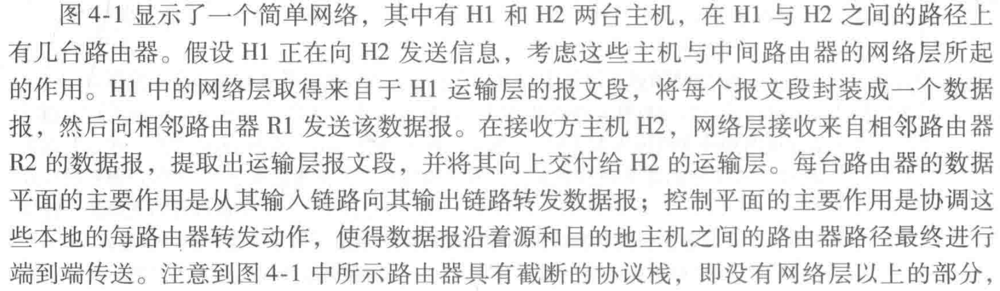
	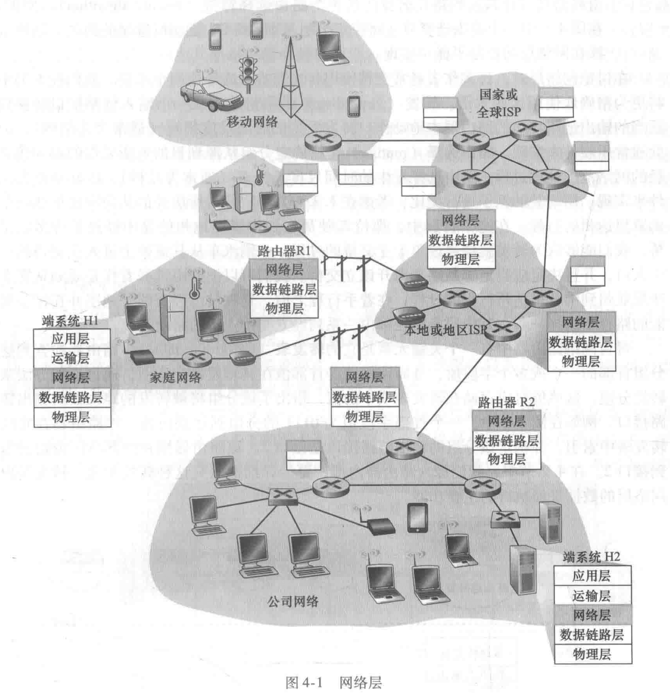
	- 转发和路由选择：数据平面和控制平面
		网络层两个重要的功能：
		1. **转发（forwarding）**：在网络路由器中会维护一个关键元素——**转发表（forwarding table）**，它将到达的分组从一个输入链路接口转移到适当的输出链路接口的路由器本地动作。转移发生时间很短（几纳秒），因此常用硬件来实现。
		2. **路由选择（routing）**：**路由选择算法（routing algorithm）**确定分组从源到目的地所采取的端到端路径的网络范围处理过程。选择发生的时间尺度长得多（通常为几秒），因此常用软件来实现。
	- **网络服务模型（network service model）**
		该服务模型可能包括，
		1. **确保交付**
		2. **具有时延上界的确保交付**
		3. **有序分组交付**
		4. **确保最小带宽**
		5. **安全性**
		因特网的网络层只提供了单一的服务，即**尽力而为服务（best-effort service）**。虽然看似问题非常大，但事实是实践中效果“足够好”，能够用于大量的应用。
		注意几个术语，
		1. **分组交换机**：指一台通用分组交换设备，根据分组首部字段中的值，从输入链路接口到输出链路接口转移分组。
		2. **链路层交换机（link-layer switch）**：基于链路层帧中的字段值做出转发决定，因此这些交换机又被称为链路层设备。
		3. **路由器（router）**：基于网络层数据报中的首部字段值做出转发决定，属于是网络层设备。
		因此，本章中我们将主要使用术语路由器来代替交换机。
- 路由器工作原理
	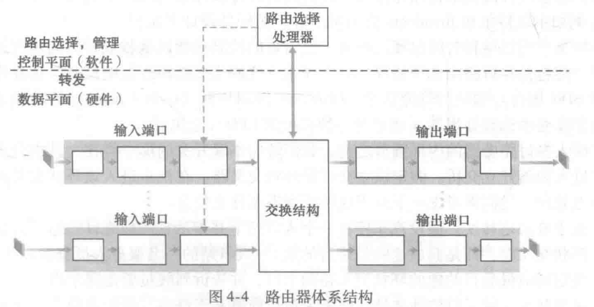
	1. 输入端口：最左侧与输出端口部分最右侧框执行在路由器中终结入物理链路的物理层功能；中间框与位于入链路远端的数据链路层交互来执行数据链路层功能；最右边的窗口执行查找功能。控制分组（如携带路由选择协议信息的分组）从输入端口转发到路由选择处理器。如下图4-5所示。
		这里的端口都是指路由器的物理输入和输出接口，与应用层、运输层中提到的和套接字相关联的软件端口完全不同，不要混淆。
	2. 交换结构：将路由器的输入端口连接到输出端口，完全包含在路由器中。
	3. 输出端口：从交换结构接收分组，并通过执行必要的链路层和物理层功能在输出链路上传输这些分组。在全双工通路中，输出端口常与输入端口成对出现在同一线路卡上。
	4. 路由选择处理器：执行控制平面功能。传统路由器中，它执行路由选择协议；SDN路由器中，负责与远程控制器通信，以接收由远程控制器计算的转发表项，并在该路由器的输入端口安装这些表项。此外，路由选择处理器还执行网络管理功能。
		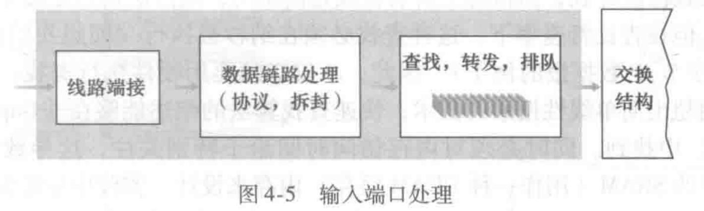
	- 输入端口处理和基于目的地转发
		输入端口处理：输入端口的线路端接功能与链路层处理实现了用于各输入链路的物理层和链路层。然后在输入端口，路由器使用转发表来查找输出端口，使得到达的分组能经过交换结构转发到该输出端口。
		注意！输入端口处理除了“查找”外，还有必须检查分组的版本号、检验和以及寿命字段，并且重写后两个字段。此外还要更新用于网络管理的计数器（如接收到的IP数据报的数目）。
		基于目的地转发：
		路由器用分组目的地址的前缀（prefix）与转发表的表项进行匹配。如果同时存在两个及以上的前缀与目的地址匹配，则路由器使用最长前缀匹配规则（longest prefix matching rule），即在路由器转发表中寻找最大的匹配项，并向与最长前缀匹配相关联的链路接口转发分组。
		注意！在路由转发表中查找的时候，有速度和并发等需求，因此不仅必须要用硬件执行查找，而且需要对大型转发表使用超出简单线性搜索的技术，比如一些快速查找算法等。同时必须对内存访问时间给予特别关注，比如嵌入式片上DRAM和更快的SRAM内存来设计。实践中也经常使用**三态内容可寻址存储器（Tenary Content Address Memory，TCAM）**来查找。
	- 交换（三种交换技术）
		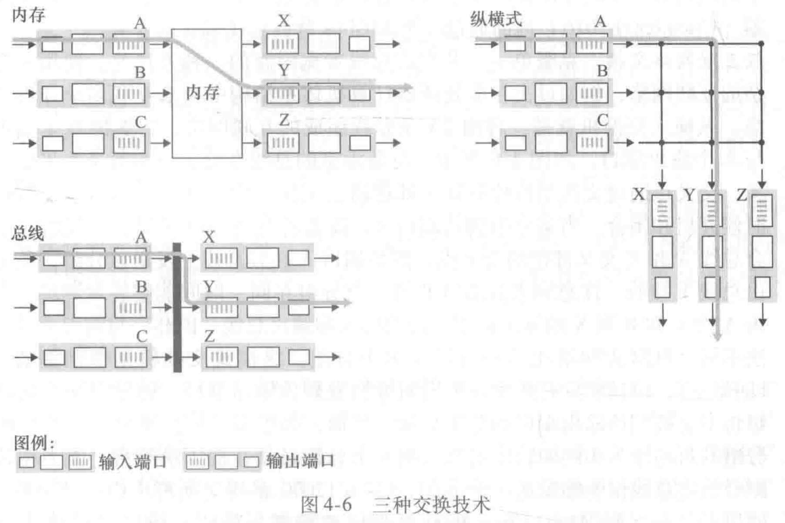
		1. 经内存交换：最简单、最早的路由器在CPU的直接控制下完成，从输入端口输入，经内存交换处理放入输出端口的缓存中。在这种情况下，如果内存带宽为每秒可写进内存或从内存读出最多B个分组，则总的转发吞吐量（分组从输入端口被传送到输出端口的总速率）必然小于B/2。而且因为经过共享系统总线，因此一次只能执行一次内存读/写。
			现代内存路由器与早期路由器的一个主要差别是，目的地址的查找和将分组存储（交换）进适当的内存存储位置是由输入线路卡来处理的。在某些方面，经内存交换的路由器看起来很像共享内存的多处理器。
		2. 经总线交换
			输入端口经一根共享总线将分组直接传送到输出端口，不需要路由选择处理器的干预。通常，我们让输入端口为分组预先计划一个交换机内部标签（首部），指示本地输出端口，使分组在总线上传送和传输到输出端口。该分组能由所有输出端口收到，但只有与该标签匹配的端口才能保存该分组。当多个分组同时到达路由器，需要排队等待，一次只能一个分组跨越总线。常用于小型局域网和企业网中的路由器。
		3. 经互联网络交换
			如图4-6中，纵横式网络中，输入端口A要转发到输出端口Y，则交换机控制器会闭合总线A和Y交叉部位的交叉点，这样端口A就在总线上发送该分组，该分组只能被总线Y接收。与前面两种交换方式相比，纵横式网络能够并行转发多个分组，纵横式交换机是**非阻塞的（nonblocking）**，只要没有其它分组当前被转发到该输出端口，则转发到输出端口的分组将不会被到达输出端口的分组阻塞，如果不同输入端口的两个分组同时向相同的输出端口发送一个分组，则后一个分组需在输入端等待。
			现在更复杂的互联网络使用多级交换元素，以使来自不同输入端口的分组通过交换结构同时朝着相同的输出端口前行，这是**从交换机体系结构的角度上的发展**；此外，**路由器**的交换能力也能够通过**并行运行多种交换结构**进行扩展。比如输入端口和输出端口被连接到并行的N个交换结构上，于是一个输入端口将一个分组分成K个小块，通过这N个交换结构中的K个发送到输出端口，再在输出端口组装。
		- 输出端口处理
			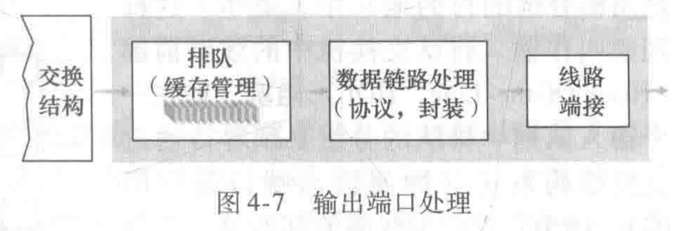
		- 何处出现排队
			在输入端口和输出端口都可能形成分组队列，排队的位置与程度与流量负载、交换结构的相对速率和线路速率等有关。
			什么情况下几乎不会发生排队，或者排队几乎可以忽略不计？假定R-line（单位为每秒分组数）为输入线路速度和输出线路速度（传输速率），R-switch为从输入端口到输出端口能够移动分组的速率。如果R-switch比R-line快N倍，则可以忽略不计。因为即使在最坏的情况下，所有N条输入线路都在接收分组，并且所有的分组将被转发到相同的输出端口，每批N个分组也能够在下一批到达前通过交换结构处理完毕，但实际这种情况下，分组队列仍有可能在输出端口形成。比如在正好传输N个分组之一的时间中，可能又到达N个分组，等等。最终，排队的分组数量能够变得足够大，耗尽输出端口的可用内存，产生**弃尾（drop-tail）**等现象。
			1. 输入排队
				输入队列交换机中的**线路前部（Head-Of-the-line，HOL）阻塞**——一个输入队列中排队的分组必须等待通过交换结构发送（即使输出端口是空闲的），因为它被位于线路前部的另一个分组所阻塞。
			2. 输出排队
				在**“何处出现排队”**部分中，还有一种对分组队列的处理方法，是在缓存填满之前便丢弃一个分组（或在其首部加上标记），从而向发送方提供一个拥塞信号。这种策略被称为**主动队列管理（Active Queue Management，AQM）**算法。目前最广泛研究和使用的AQM算法如，**随机早起检测（Random Early Detection，RED）**。
			- 分组调度
				不管是输入端口还是输出端口形成了等待队列后，都需要**分组调度（packet scheduler）**在这些排队分组中选择一个分组来传输。
				关于路由器缓存的讨论，路由器需要一定容量的缓存来吸收流量负载的波动，关于需要多少缓存有基于相对少量的TCP流的排队动态性分析得到的经验[Villamizer 1994]，即，
					缓存数量（B）= 平均往返时延（RTT）* 链路容量（C）
				而最新研究发现，当有大量的TCP流（N条）流过一条链路时，缓存所需数量计算方法为，
					缓存数量（B）= 平均往返时延（RTT）* 链路容量（C）/sqrt(N)
				1. **先进先出（First-In-First-Out，FIFO）**又称**先来先服务FCFS**
					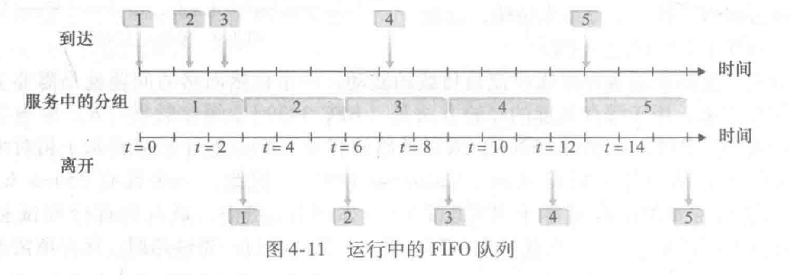
				2. **优先权排队（Priority queuing）**
					实践中，网络操作员可以配置一个队列，这样携带网络管理信息的分组（例如，由源或目的TCP/UDP端口号所标识）获得超过用户流量的优先权等
					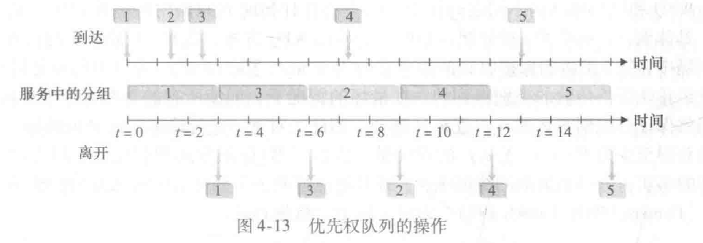
				3. **循环和加权公平排队（round robin queuing discipline）**
					**保持工作排队（work-conserving queuing）规则**：在有（任何类的）分组排队等待传输时，不允许链路保持空闲。当寻找给定类的分组但是没有找到时，保持工作的循环规则将立即检查循环序列中的下一个类。
					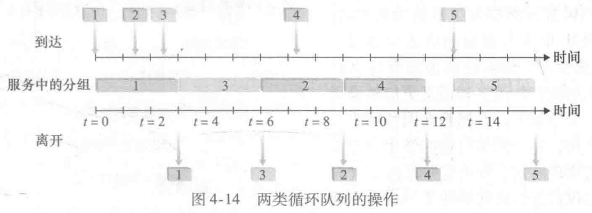
					目前在路由器中被广泛使用的一种通用形式的循环队列——加权公平队列（Weight Fair Queuing，WFQ）
					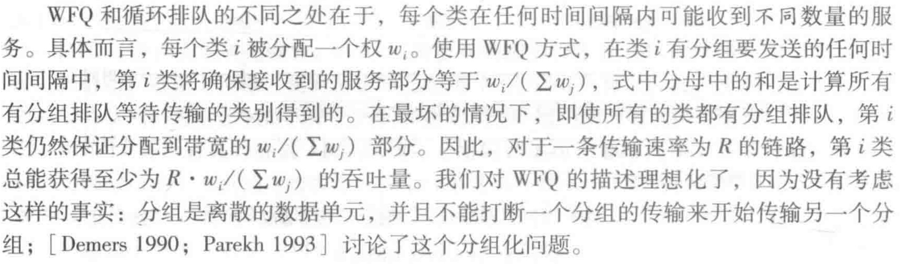
- 网际协议：IPv4、寻址、IPv6及其他
	- IPv4数据报格式
		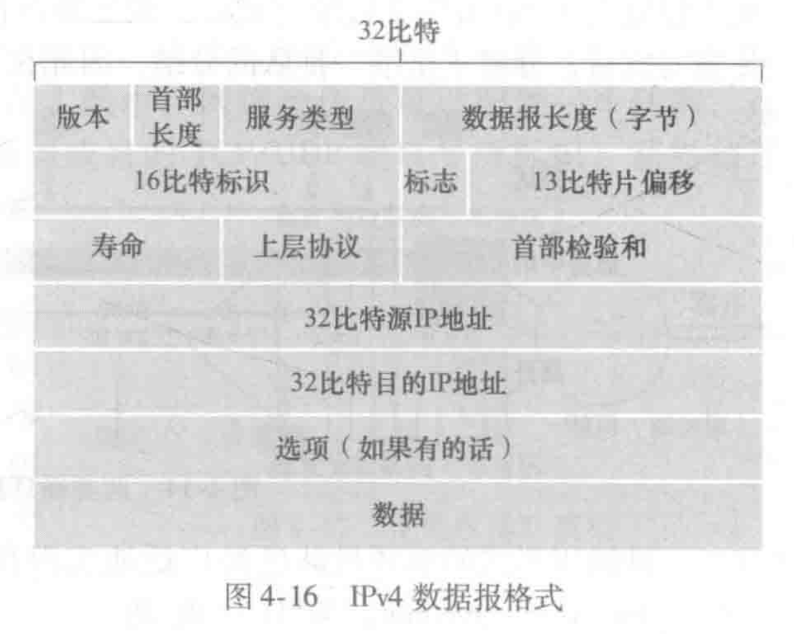
	1. **版本**：指定IPv4还是IPv6
	2. **首部长度**：因为IPv4数据报中包含一些可变数量的选项，因此用4比特来确定IP数据报中载荷实际开始的地方。一般的IP数据报不包含选项，因此一般的IP数据报具有20字节首部。
	3. **服务类型（TOS）**：提供特殊等级的服务以便使不同类型的IP数据报能相互区别开来。
	4. **数据报长度**：记录IP数据报的总长度（首部加上数据），以字节计。16比特，理论最大可计长度为65535字节，然而数据报实际长度很少超过1500字节，该长度使得IP数据报能容纳最大长度以太网帧的载荷字段。
	5. **标识、标志、片偏移**：与IP报文段分片有关。
	6. **寿命（Time-To-Live，TTL）**：用来保证数据报不会永远在网络中循环。每当一个路由器处理数据报时，该字段的值减1，TTL字段减为0，则数据报丢弃。
	7. **协议**：在IP数据报到达目的地后，指示了IP数据报的数据部分应交给哪个特定的运输层协议。比如，值为6表明数据报交付给TCP，值为17表明数据报交付给UDP，等等。IP数据报中的协议号的作用，类似于运输层报文段端口号将运输层和应用层绑定到一起、链路层帧将链路层与网络层绑定到一起。
	8. **首部检验和**：帮助路由器检测收到的IP数据报的比特错误。注意！每经过一台路由器要检验一次，并重新计算检验和存放覆盖原检验和，因为TTL字段以及可能的选项字段会改变。
		提问：为什么TCP/IP在运输层和网络层都执行差错检测？
		答：首先，IP层只对IP首部计算检验和，而TCP/UDP检验是对整个TCP/UDP报文段进行的；其次，TCP/UDP与IP不一定都必须属于同一个协议栈，原则上，TCP能够运行在一个不同的协议上，而IP能够携带不一定要传递给TCP/UDP的数据。
	9. **源和目的IP地址**：寻址用。
	10. **选项**：选项字段允许IP首部被扩展。选项的存在有个弊端就是首部长度不固定，导致一台路由器处理一个IP数据报所需的时间变化可能很大，这对高性能路由器和主机上的IP处理是重大打击。因此，在IPv6中可以看到IP选项已经被取消。
	11. **数据（有效载荷）**：需要传递的内容，通常，在IP数据报中的数据字段包含要交付给目的地的运输层报文段（TCP或UDP）。如果一个IP数据报有总长为20字节的首部，数据报再承载一个20字节的TCP首部，那报文段就是总长40字节的首部+应用层报文。
	- IPv4数据报分片
		向下链路层协议并不是都能承载相同长度的网络层分组。比如以太网帧不超过1500字节，而某些广域网帧则不能超过576字节。因此需要对数据报进行分片。
		一个链路层帧能承载的最大数据量叫作**最大传送单元（Maximum Transmission Unit，MTU）**。因为发送方和目的地路径上的每段链路可能使用不同的链路层协议，且每种协议可能具有不同的MTU。这就会导致可能某个路由器收到的IP数据报要转发的链路协议支持的MTU比当前IP分组要小，因此只能采取分片的策略，将IP数据报中的数据分片成两个或更多个较小的IP数据报，在用单独的链路层帧封装这些较小的IP数据报，每个这些较小的数据报都被称为**片（fragment）**。
		这里就要提到**标识、标志和片偏移字段**了，因为路由器中组装又拆分很影响性能，于是IPv4设计者直接将组装过程放到端系统中进行。通过标识，区分数据报的发送者是否是同一主机；通过标志，区分这些片哪个是最后一个片（最后一个片的标志为0，其它片的标志为1，因为IP是不可靠传输服务）；通过片偏移字段，来区分片的正确顺序。
	- IPv4编址
		一个IP地址与一个接口相关联，而不是与包括该接口的主机或路由器相关联。IP地址采用**点分十进制记法（dotted-decimal notation）**。IP编址则用**子网掩码（network mask）**表示。
		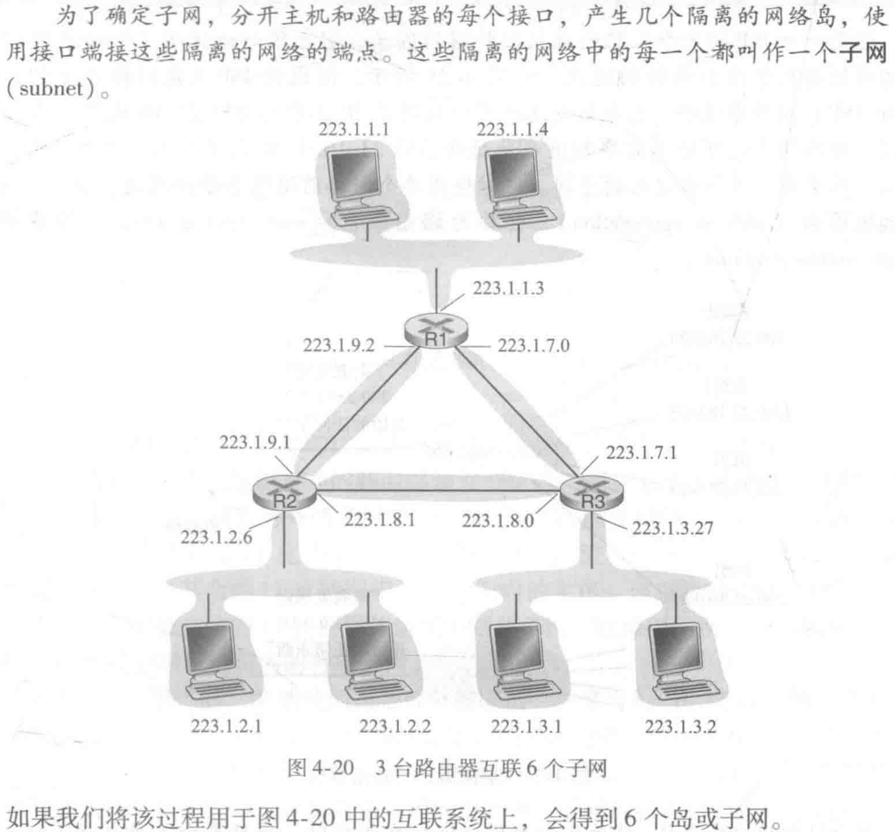
		因特网的地址分配策略被称为**无类别域间路由选择（Classless Interdomain Routing，CIDR）**。当使用子网寻址时，32比特的IP地址被划分为两部分，用点分十进制数形式a.b.c.d/x表示，其中x指示了地址的第一部分中的比特数——**地址前缀（prefix）**。这样，当路由器转发一个数据报时，则只需要考虑数据报目的地址的前面x比特，相当大地减少了在这些路由器中转发表的长度。
		路由器或主机端系统通过使用单个网络前缀通告多个网络的能力通常称为**地址聚合（address aggregation）**，也称为**路由聚合（route aggregation）**或**路由摘要（route summarization）**。当目的地址同时和两个及以上的地址前缀想匹配时，采用**最长前缀匹配策略**，转发到与目的地址相匹配的最长（最具体）的地址前缀。
		在CIDR之前，IP地址的网络部分被限制为长度为8、16或24比特——**分类编址（classful addressing）**。因为具有8、16或24比特子网地址的子网分别被称为A、B和C类网络。
		一个特殊类型的IP地址，即IP广播地址255.255.255.255，当主机发出一个目的地址为255.255.255.255的数据报时，报文将交付给网络中的所有主机，路由器则是向近邻的子网转发该报文。
		1. 获取一块地址
			从ISP出获取。比如ISP已被分配地址块200.23.16.0/20，那就可以均分成下列8个地址块，
			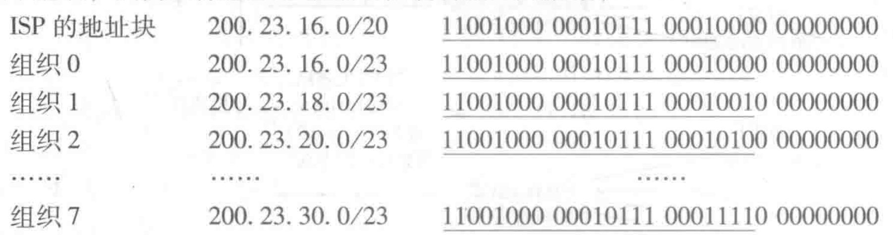
		2. 获取主机地址：动态主机配置协议
			联网就会分配一个IP地址，一种方式是远程通过网络管理工具进行配置；另一种方式是手动配置主机地址，目前更多用的是**动态主机配置协议（Dynamic Host Configuration，DHCP）**。DHCP允许主机自动获取（被分配）一个IP地址，网络管理员能够配置DHCP，使得某给定主机每次都用一个IP地址，或者某主机被分配一个**临时的IP地址（temporary IP address）**，这样的话被称为就具有了自动的能力，它被称为**即插即用协议（plug-and-play protocol）**或**零配置（zeroconf）协议**。这就是无线网络连接和主机IP分配的原理。
			DHCP是一个客户-服务器协议。客户通常是新到达的主机，它要获得包括自身使用的IP地址在内的网络配置信息。最简单场合下，每个子网将具有一台DHCP服务器。如果没有，则需要一个路由器作DHCP中继代理来充当这一角色。如下图4-23中的路由器就代理了223.1.1/24和223.1.3/24。
			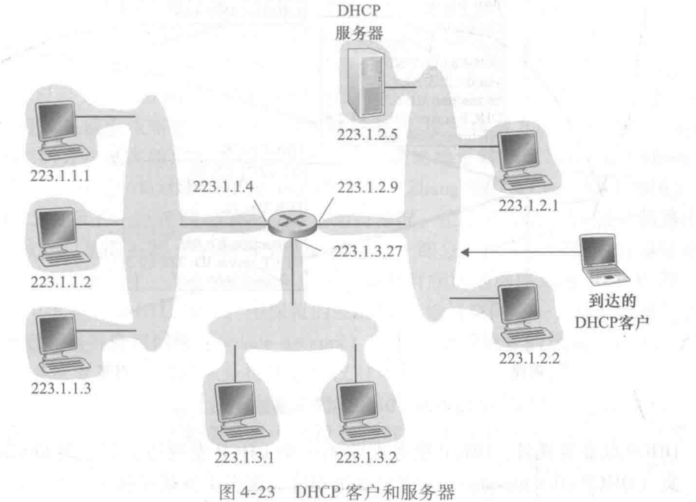
			DHCP分配过程，
			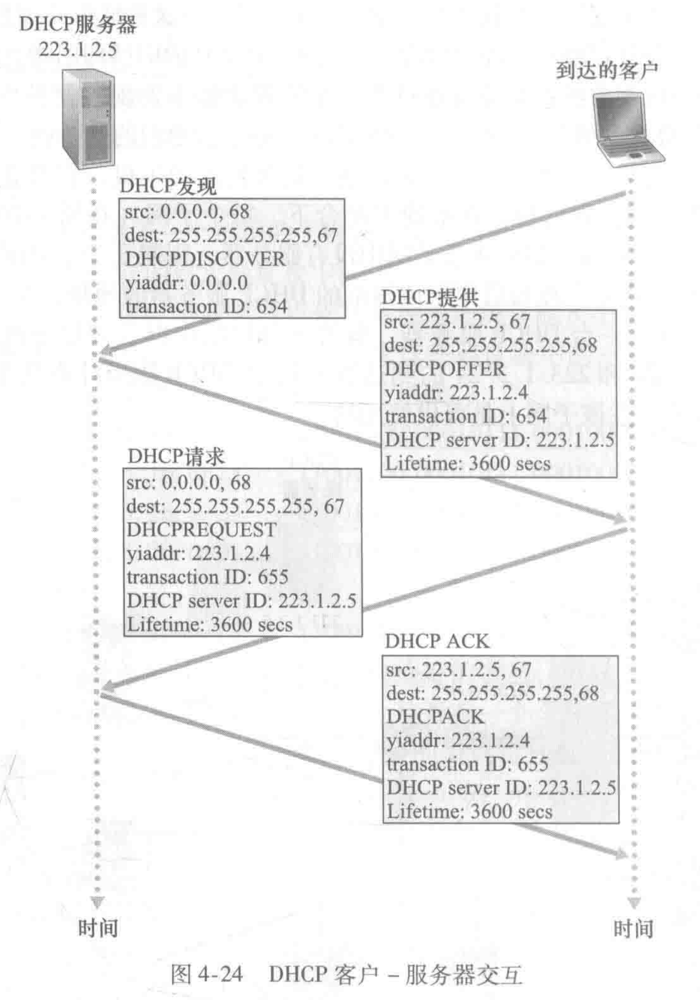
			DHCP发现：客户主机广播**DHCP发现报文（DHCP discover message）**，DHCP客户生成包含DHCP发现报文的IP数据报，然后将该IP数据报传递给链路层，链路层然后将该帧广播到所有与该子网连接的节点。
			DHCP服务器提供：DHCP服务器收到后，用DHCP提供报文（DHCP offer message）做出相应。向子网的所有节点广播，仍然使用IP广播地址255.255.255.255。会有多台服务器能够提供，于是每台服务器需要提供的报文包含收到**发现报文的事务ID**、**向客户推荐的IP地址**、**网络掩码**以及**IP地址租用期（address lease time）**。
			DHCP请求：然后客户选择一个IP地址，并向选中的服务器提供DHCP请求报文（DHCP request message），回显配置的参数。
			DHCP ACK：服务器用DHCO ACK报文（DHCP ACK message）响应，证实所需要的参数。
			如上，DHCP主动分配完成。但是DHCP有严重缺陷，当节点在子网间移动时，TCP连接必须要断开。目前有移动IP的相关研究，允许移动节点在网络之间移动时采用单一永久的地址。
		- 网络地址转换
			当小型办公室（Small Office，Home Office，SOHO）已经分配过子网，现在联网设备增加了而子网地址不够时怎么办？目前采用的方法是：**网络地址转换（Network Address Transmission，NAT）**。
			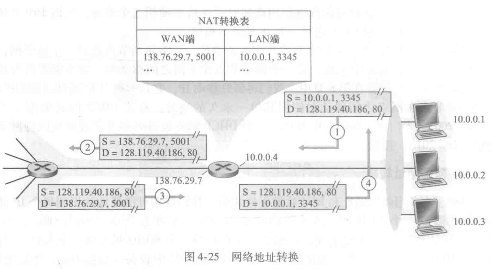
			NAT就是在路由器上维护一个**NAT转换表（NAT transmission table）**，家庭网络发来的报文经过路由器转换，就变成了该路由器广域网一侧接口的IP地址，以及为该数据报生成一个新的源端口号，因为端口号字段为16比特长，NAT协议可支持超过60000个并行使用路由器广域网一侧单个IP地址的连接。等Web服务器收到数据报并相应回复被该路由器接收到后，该NAT路由器再用NAT转换表检索出家庭网络浏览器使用的适当的IP地址和目的端口号。
			以上整个过程就相当于用近邻路由器做了一个代理，就是公网和内网转换而已。这样的话，家庭网对外就是一个IP地址，这样就可以大大减少IP地址占用。
			这样当然就有人提出质疑，端口号是用来进程寻址的，而不是用来主机寻址。而服务器进程在周知端口号上等待入请求，并且P2P协议中的对等方在充当服务器时需要接受入连接。（这句话的意思就是，本来主机是只能发起连接，服务器是可以发起也可以被动接受连接的，因为主机端口被用户控制，而服务器端口是直接公开的，所以当主机A想主机B发起连接的时候，因为NAT是动态变化的，所以主机A即便知道主机B的IP和端口号，也不知道该往NAT发什么，因为不知道主机B的公网IP）。目前有解决方案包括**NAT穿越（NAT traversal） 工具**和**通用即插即用（Universal Plug and Play，UPnP）**。UPnP是一种允许主机发现和配置近邻NAT的协议。
			从体系结构来讲，路由器是网络层设备，应该直接和主机对话而不能干涉节点修改IP地址，更不用说进程端口号了。但目前NAT已经成为因特网汇的一个重要组件，成为**中间盒**。它运行在网络层并具有与路由器十分不同的功能。中间盒不执行数据报的转发，而执行如NAT、流量流的负载均衡、流量防火墙等功能。
		- IPv6 
			1. IPv6数据报格式
				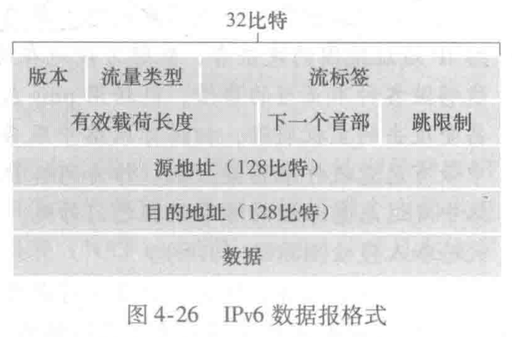
				与IPv4相比新增的首部字段：
				- **扩大的地址容量**：IPv6将IP地址长度从32比特增加到128比特。同时IPv6还引入了**任播地址（anycast address）**，即可以向一组包含给定文档的镜像站点中的最近一个发送HTTP GET报文。
				- **流标签**：给属于特殊流的分组加上标签，这些特殊流是发送方要求进行特殊处理的流。如音频与食品传输就可能被当作一个流。更传统的应用（如电子邮件）就不会被当成流。付费用户也可能被当作一个流。
				- **流量类型**：8比特字段，与IPv4中的TOS字段的含义相似。
				- **有效载荷长度**：给出IPv6数据报中跟在定长的40字节数据报首部后面的字节数量。
				- **下一个首部**：标识数据报中的内容需要交付给哪个协议（如TCP或UDP）。
				- **跳限制**：跳限制计数达到0，则该数据报将被丢弃。
				与IPv4相比删掉的首部字段：
				- **分组/重新组装**：不允许在中间路由器上分片与重新组装，而只能在源和目的端执行。如果IPv6数据报因太大不能转发到出链路上，则路由器直接丢弃，并向发送方发回一个“分组太大”的ICMP差错报文即可。发送方重发即可。
				- **首部检验和**：因为运输层和数据链路层都有检验操作，加上IPv4首部中包含TTL字段，导致在每一个路由器都要重新计算首部检验和并重写，这些操作不必要且耗时。
				- **选项**：不再是标准IP首部的一部分，但是能够作为IPv6首部中由“下一个首部”指出的位置上。同时，删除选项字段使得IP首部成为定长的40字节。
			2. 从IPv4到IPv6的迁移
				**建隧道（tunneling）**：将链路中的IPv4路由器的集合称为一个**隧道（tunnel）**。当要通过IPv4路由器传输时，就将IPv6数据报整个当成IPv4的数据封装一个IPv4，并发往隧道接收端的IPv6节点，到了之后解析出数据就是IPv6数据报。
				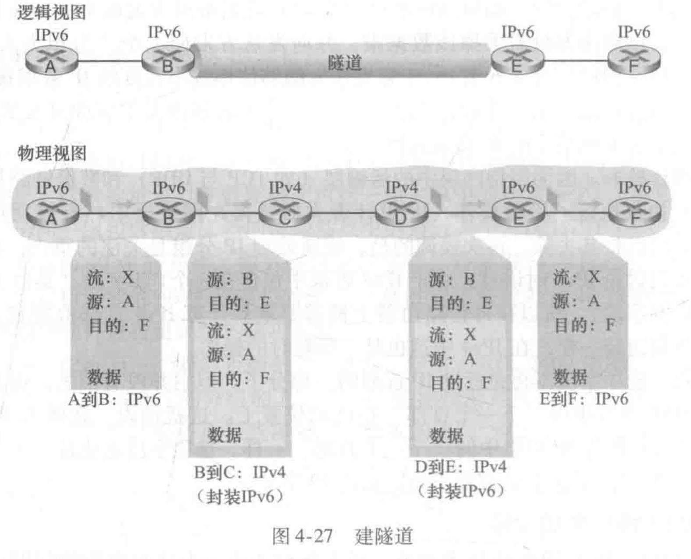
- 通用转发和SDN
	网络层的中间盒有很多的发展。NAT盒重写首部IP地址和端口号；防火墙基于首部字段阻拦流量或重定向分组，如深度分组检测（DPI）；负载均衡器将请求某种给定服务的分组转发到提供该服务的服务器集合中的一个，等等。
	一般化后，我们将运输层的“交换机”和网络层的“路由器”更准确地描述为“分组交换机”。
	- 匹配
		
	- 动作
	- 匹配加动作操作中的OpenFlow例子
		1. 第一个例子：简单转发
		2. 第二个例子：负载均衡
		3. 第三个例子：充当防火墙
- 小结

#### 课后题答案

#### 课文中实验答案

#### 编程作业和答案

#### Wireshark实验和答案

